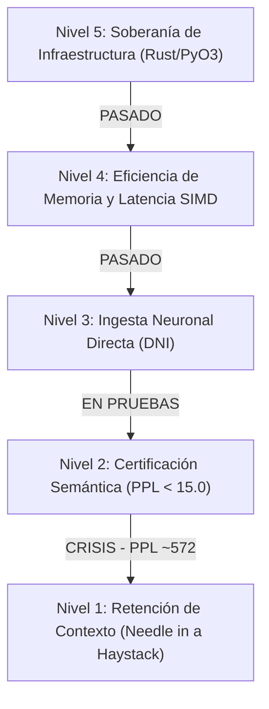

# 🧬 Protocolo GAJE: Adaptación Semántica y Compresión Genómica (v1.0.0-alpha)

[](CHANGELOG.md)
[](src/)
[](LICENSE)
[](README.en.md)

**GAJE (Genomic Adaptive Joint Embedding)** es un protocolo de investigación y computación de ultra-alta densidad diseñado para la ejecución y compresión de Modelos de Lenguaje Masivos (LLMs). El protocolo cuantiza el espacio de parámetros a una representación discreta de **2 bits por peso** (utilizando un alfabeto genómico digital de 4 estados: `00=A`, `01=C`, `11=G`, `10=T`), mapeado a manifolds en una **Topología Circular de Fase**.

---

## 🔬 Estado Empírico y Diagnóstico Científico (Nivel Alpha)

Siguiendo el principio de **Verdad Empírica** (`docs/meta/EMPIRICAL_TRUTH_STATE.md`), el sistema presenta el siguiente estado funcional certificado:



### 1. Capa de Infraestructura (Niveles 5 y 4: PASADO 🟢)
* **Soberanía Nativa (Rust Core):** El motor principal está escrito 100% en Rust con abstracciones de cero costo y enlace bidireccional mediante `PyO3` (`maturin`).
* **Seguridad de Memoria y Tolerancia a Fallos:** La arquitectura nativa intercepta la desalineación de límites mediante envolventes de tipo `Result<T, E>`, garantizando estabilidad sin pánicos en tiempo de ejecución.
* **Aceleración SIMD:** Descuantización vectorizada JIT para descompresión sobre la marcha en registros CPU sin descompresión previa en disco.

### 2. Capa Semántica y Dinámica (Niveles 2 y 1: EN RESCATE 🟡)
* **Colapso Semántico por Cuantización Uniforme:** La compresión rígida a 2-bits causa un colapso en la entropía del vocabulario, reflejado en una Perplejidad (PPL) empírica de **~572**.
* **Estabilización de Vocabulario:** Se implementó un mecanismo de mapeo cíclico de seguridad (*Safe Modulo Indexing*) en el núcleo de Rust (`GenomicLLM`) para prevenir excepciones por desbordamiento de índices entre tokenizadores heterogéneos y espacios de embeddings comprimidos.

---

## 🛠️ Fundamentos Arquitectónicos

### 1. Muestreo Lagrangiano de Mínima Acción
La generación de tokens se modela como un sistema dinámico regido por el principio de mínima acción. El espacio de fase evalúa la energía cinética $T$ (movilidad semántica) y el potencial $V$ (restricción gramatical):

$$\mathcal{L} = T - V$$

Un Sampler Toroidal aplica frenado dinámico para estabilizar las transiciones de probabilidad y mitigar la alucinación producida por la cuantización agresiva.

### 2. Hebras Reguladoras de ARN (Precisión Adaptativa)
El sistema utiliza **Entropía de Shannon** para medir la incertidumbre del estado oculto final $h_{\text{norm}}$. Cuando la entropía supera un umbral dinámico $\tau_{\text{RNA}}$, la red activa de forma secundaria hebras complementarias de 2-bits (alcanzando 4-bits efectivos en regiones de alta complejidad).

### 3. Inhibición Lateral K-WTA (K-Winners-Take-All)
Para contrarrestar el ruido cuántico intrínseco de los centroides de 2-bits, se aplica un filtro competitivo temporal que silencia el $(100 - K)\%$ de las neuronas de menor resonancia en el `lm_head`, restaurando la nitidez de los logits de salida.

---

## 📊 Matriz de Certificación Empírica

| Métrica / Fase | Cuantización Uniforme 2-bit | Meta de Rescate (Q3 2026) | Estado Actual |
| :--- | :---: | :---: | :---: |
| **Soberanía Nativa (Zero-GIL)** | 100% Rust / PyO3 | 100% Rust | ✅ **Certificado** |
| **Perplejidad Semántica (PPL)** | ~572.0 (Ruido) | **< 15.0 (Elocuente)** | 🔴 **Fase de Rescate** |
| **Estabilidad de Memoria** | O(1) Overhead | O(1) Overhead | ✅ **Certificado** |
| **Resistencia a Desbordamiento** | Mapeo Cíclico Activo | Validación Dinámica | ✅ **Implementado** |
| **Retención de Aguja (Needle Test)** | En Validación | **> 85.0%** | 🟡 **En Ejecución** |

---

## 📂 Organización del Repositorio (`v1.0.0-alpha`)

```
gaje-semantic-compression/
├── src/                    # Núcleo Nativo en Rust (Kernels SIMD, LLM Engine, KV-Cache)
├── python/gaje/            # Puente PyO3 y Wrappers de Investigación
├── tests/                  # Suite de Pruebas (Unitarias, Integración, Métricas)
│   ├── unit/               # Validación de Kernels y Normalización
│   ├── integration/        # Verificación del Pipeline Completo
│   └── metrics/            # Pruebas de Perplejidad e Interferencia DNI
├── benchmarks/             # Evaluación de Rendimiento y Registros de PPL
├── scripts/                # Herramientas de Mantenimiento y Benchmarking
├── data/                   # Datasets Centralizados y Parámetros de Entrenamiento
└── docs/                   # Documentación Científica y Protocolos SDD/BDD
```

---

## ⚡ Guía de Compilación y Verificación

### 1. Entorno Virtual y Dependencias
```bash
# Crear entorno virtual optimizado
uv venv && source .venv/bin/activate

# Instalar paquete en modo desarrollo
pip install -e ".[dev]"
```

### 2. Compilación del Motor Nativo (PyO3)
Para compilar la extensión en C-ABI optimizada con soporte completo para Python:
```bash
maturin develop --release --features python
```

### 3. Ejecución de Pruebas Unitarias y Benchmarks
```bash
# Pruebas nativas de Rust
cargo build --release

# Suite de integración en Python
pytest tests/
```

---

## 🗺️ Hoja de Ruta (Q3 2026: Island Model)

1. **Island Model (Evolución por Nichos):** Segmentación distribuida del genoma neuronal para mitigar la interferencia catastrófica.
2. **Native Semantic RAG:** Inyección de Stability Anchors directamente en memoria contigua compartida (`Arc<Vec<u8>>`).
3. **Optimización K-WTA:** Filtrado competitivo en el kernel SIMD de Rust para reducción de ruido en tiempo real.

---

## ⚖️ Licencia y Gobernanza
Licenciado bajo la **GNU Affero General Public License v3.0 (AGPL-3.0)**. Ver [LICENSE](LICENSE) para más información.

---
*Protocolo GAJE-Flow v1.0.0-alpha (Silver Adult) — Hacia la Soberanía de la Inteligencia Genómica.*
