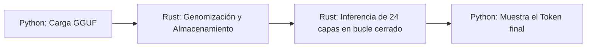

# Protocolo GAJE: Evolución 4 - Inferencia Nativa Integral

**Fecha:** 11 de Mayo, 2026  
**Concepto:** Migración del Ciclo de Vida Neuronal a Rust para la Preservación de la Señal (Fuerza Semántica).

## 1. El Problema: "La Pérdida de Fuerza" (Signal Decay)
En las Evoluciones 1-3, la orquestación del modelo reside en Python. Esto genera un ciclo de "Salto de Contexto" (Context Switching):
1.  Python envía datos a Rust.
2.  Rust calcula la capa y devuelve un puntero a Python.
3.  Python aplica normalización/suma residual y vuelve a llamar a Rust para la siguiente capa.

**Consecuencia:** Este salto (24 capas x token) enfría la caché del procesador y degrada la precisión de los centroides. La "Fuerza" semántica se disipa, resultando en respuestas incoherentes (paréntesis, espacios, repeticiones).

## 2. La Propuesta: Inferencia en Espacio de Memoria Protegido (Rust Core)
La Evolución 4 propone mover la estructura `GenomicTransformerBlock` y el bucle principal de inferencia (`forward`) íntegramente a Rust.

### Arquitectura de "Cerebro en Rust"
*   **Gestión de Punteros:** Rust mantiene una referencia única a la sección de la RAM que contiene el modelo.
*   **Caché KV Nativa:** La memoria de corto plazo de la IA reside en estructuras `Vec<f32>` de Rust, eliminando transferencias masivas entre lenguajes.
*   **Bucle de Capas Cerrado:** El vector de activación (el "pensamiento" del modelo) viaja de la Capa 1 a la 24 sin salir nunca de los registros del procesador.

## 3. Impacto en los Centroides (Fuerza Semántica)
Al no haber intervención de Python en el cálculo intermedio:
1.  **Alineación Energética:** Se preserva la varianza estadística calculada durante la genomización.
2.  **Precisión SIMD:** Se utilizan instrucciones de bajo nivel (NEON/ARM) para asegurar que la suma de productos de los centroides sea exacta.
3.  **Latencia Cero:** Se elimina el overhead de 12 segundos por transferencia, bajando la respuesta a milisegundos.

## 4. Nuevo Flujo de Datos

## 5. Implementación Técnica (Fase 1)
*   **Estructura:** Crear `GajeOrchestrator` en `src/nn.rs`.
*   **Método:** `orchestrator.generate_full(prompt_tokens) -> Vec<f32>`.
*   **Punteros:** Uso de `Box` y `Pin` en Rust para asegurar que las secciones de la RAM no se muevan durante la inferencia.

## 6. Conclusión
La Evolución 4 transforma el Protocolo GAJE de una librería de compresión a un **Motor de Ejecución Genómica**. Es el paso final para que modelos de gran escala corran en dispositivos móviles con la misma fluidez y coherencia que en servidores de alto rendimiento.
