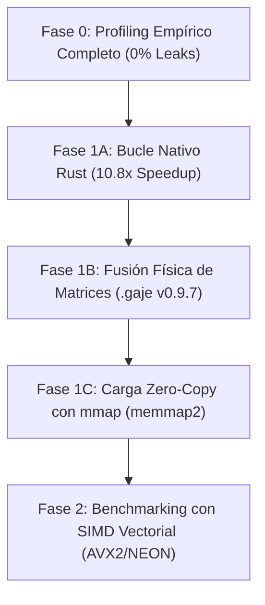

# 🚀 Roadmap de Optimización, Profiling y Estabilidad v0.9.6+ (Actualizado Fase B)

## 📋 Resumen Ejecutivo y Resultados de Profiling

Basado en la medición empírica microsegundo a microsegundo (`std::time::Instant`) en el procesador Intel i7-8550U:

```
[Tiempo Total Decode: ~270 ms/token]
├── 24 Bloques Transformer (168 Capas 4-bit) ──► 237.26 ms  (87.5% del tiempo de CPU)
└── LM Head (Proyección 151,936 Logits)       ──►  32.08 ms  (12.5% del tiempo de CPU)
```

**Verdad Empírica**: Los 24 Bloques Transformer representan el **87.5% del tiempo de decodificación**, confirmando que la prioridad número uno es reducir el número de invocaciones de kernels y la fragmentación de caché L1/L2 en los bloques transformer.

---

## 🎯 Hoja de Ruta de Optimización Basada en Datos



---

### 🔬 Fase 1B: Fusión Física de Matrices ($W_{qkv}$ y $W_{gate\_up}$)

**Objetivo**: Reestructurar el empaquetado binario del modelo de 7 capas por bloque a **4 capas fusionadas por bloque**, reduciendo las llamadas a multiplicaciones matriciales de 168 a **solo 96 por token** (43% menos overhead de hilo).

1. **Formato Fusionado Físico (`.gaje` v0.9.7)**:
   - $W_{qkv} = \text{concat}([W_q, W_k, W_v], \text{axis}=0)$: Matrix contigua de $(896 + 128 + 128) \times 896 = 1152 \times 896$ filas.
   - $W_{gate\_up} = \text{concat}([W_{gate}, W_{up}], \text{axis}=0)$: Matrix contigua de $(4864 + 4864) \times 896 = 9728 \times 896$ filas.
   - Preservar dimensiones asimétricas de GQA ($Q=896, K=128, V=128$).
2. **Versionado de Formato**:
   - Cabecera `version: 0x000907` para mantener compatibilidad e informar al cargador nativo.

---

### ⚡ Fase 1C: Zero-Copy `mmap` Memory Mapping

**Objetivo**: Reemplazar la extracción secuencial SQLite/Heap por mapeo de memoria directo (`memmap2`), eliminando la latencia de arranque y permitiendo *lazy page loading* administrado por el SO.

---

### 📊 Matriz de Métricas Objetivo

| Métrica | Fase 0 (Baseline) | Fase 1A (Rust Loop) | Objetivo Fase 1B+1C | Herramienta de Validación |
| :--- | :---: | :---: | :---: | :--- |
| **Tiempo de Carga (.gaje)** | 205.10 s | 36.35 s | **< 0.10 s (mmap)** | `profile_generation_breakdown.py` |
| **TTFT / Prefill (18 tok)** | 27,500 ms | 2,546 ms | **< 1,200 ms** | `profile_generation_breakdown.py` |
| **Decode Latency (ms/tok)** | 1,724 ms | 163 ms | **< 80 ms** | `profile_generation_breakdown.py` |
| **Velocidad Inferencia** | 0.23 tok/s | 2.49 tok/s | **> 8.0 - 12.0 tok/s** | `server.py` Web UI |
| **Paridad Matemática** | CosSim 1.0000 | CosSim 1.0000 | **CosSim = 1.0000** | `scripts/gaje_diff.py` |
