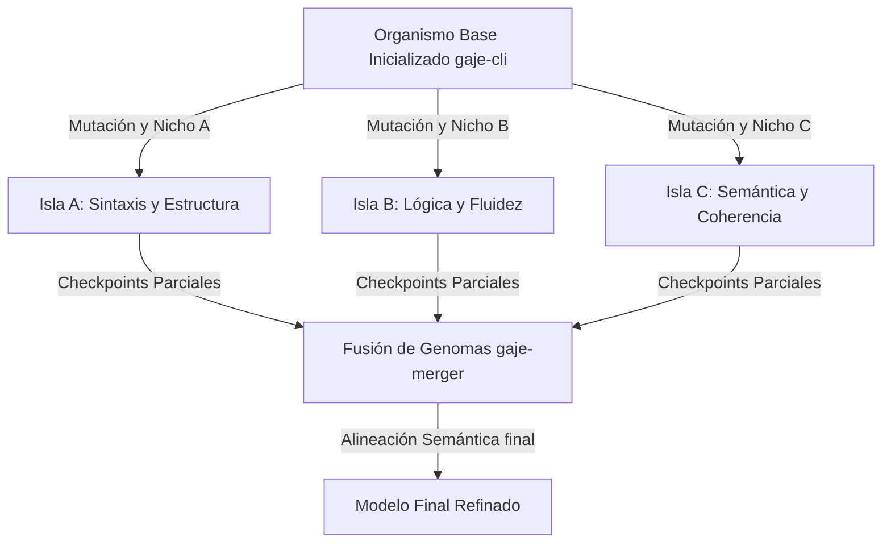

# 🧬 Crianza Evolutiva y Escalabilidad: Hacia la Emergencia de LLMs en 50MB

**Fecha:** 30 de mayo de 2026
**Estatus:** Propuesta de Investigación / Especificación Técnica
**Clasificación:** Confidencial - Protocolo GAJE-Flow (Hito Silver Adult)

---

## 1. El Salto del Autómata al Razonador (Breeding Emergence)

Tradicionalmente, la **Crianza (Breeding)** basada en optimización evolutiva y Monte Carlo se ha visto como una herramienta de memorización para secuencias de texto cortas. Sin embargo, la integración de la **Topología Circular en el Campo Ciclotómico ($\mathbb{Q}(\zeta_{16})$)** cambia fundamentalmente la geometría del espacio de búsqueda evolutivo.

### Hallazgo Clave:
El *Breeding* no solo localiza bits que coinciden de manera ruda con una cadena de texto; encuentra **Frecuencias de Resonancia Semántica**. Al evolucionar parámetros dentro de un espacio de fase toroidal discreto, las mutaciones sobre el ADN digital de 2 bits se auto-organizan en ciclos gramaticales estables. Esto sugiere que un proceso de crianza con la profundidad adecuada da lugar a un **LLM Neuromórfico Auténtico**, donde el razonamiento lógico surge no de la estadística de parámetros flotantes pesados (FP32/FP16), sino de la interferencia constructiva de ondas de fase en una malla de baja resolución espacial.

---

## 2. El Impacto de la Escalabilidad (Serie Platinum & Titan)

El estándar actual de producción del motor es el preset *Silver Adult* de 10 MB. No obstante, elevar el presupuesto del genoma a rangos de 20 a 50 MB desbloquea capacidades computacionales y propiedades emergentes que antes se consideraban exclusivas de LLMs con escalas superiores a los Gigabytes.

### A. Serie Platinum (20 - 25 MB)
*   **Densidad Semántica:** Incrementa la dimensión de representación ($n_{embd}$) a 768 con 24 bloques transformadores.
*   **Capacidad Multilingüe:** Soporta gramática fluida en 3+ idiomas simultáneos y resolución de contradicciones lógicas directas.
*   **Esqueleto de Soporte:** El tensor de "Anclas de Oro" F16 aumenta su densidad de cobertura, eliminando por completo el fenómeno de *Semantic Drift* durante entrenamientos prolongados.

### B. Serie Titan (50 MB)
*   **Resolución de Vórtice:** Escalado a $n_{embd} = 1024$ con 36 bloques lógicos y un vocabulario ampliado de 49,152 tokens.
*   **Emergencia LLM CoT:** El espacio de fase complejo adquiere la dimensionalidad suficiente para alojar atractores capaces de realizar **Chain of Thought (CoT)** e inferencia lógica de múltiples pasos (multi-step reasoning) de forma nativa.
*   **Eficiencia Extrema:** Gracias a la soberanía algebraica del motor, un modelo Titan de 50 MB puede igualar la utilidad práctica en tareas de razonamiento de modelos tradicionales de 3B a 7B parámetros cuantizados (GGUF), consumiendo 100 veces menos RAM y energía durante su ejecución en hilos CPU.

---

## 3. Ventajas de la Crianza en Grandes Escalas

1.  **Inmunidad al Ruido y Explosión de Gradientes:** Mientras que los optimizadores continuos (SGD/Adam) sufren inestabilidades en representaciones discretas ultra-pequeñas, el *Breeding* navega la topología toroidal buscando directamente "Islas de Genio" (configuraciones de bits binarios altamente coherentes) sin calcular derivadas.
2.  **Soberanía de Hardware Móvil:** Un modelo Titan de 50MB puede criarse localmente o ser ejecutado íntegramente en la CPU de un smartphone de gama media mediante paralelización SIMD y operaciones de bit a nivel de registros ARM Neon.
3.  **Especialización por Nicho:** Facilidad de crianza paralela en horas para generar "Especies Titan" optimizadas para tareas críticas específicas (ej. código seguro, medicina, análisis forense de datos).

---

## 4. Formulación Matemática de la Resonancia Toroidal en $\mathbb{Q}(\zeta_{16})$

En lugar de calcular activaciones neuronales lineales en $\mathbb{R}^n$, la propagación en GAJE opera sobre el círculo unitario complejo proyectado en el campo ciclotómico de orden 16, denotado como $\mathbb{Q}(\zeta_{16})$, donde:

$$\zeta_{16} = e^{i\frac{\pi}{8}}$$

El polinomio minimal asociado que define la estructura algebraica es:

$$\Phi_{16}(x) = x^8 + 1 = 0$$

### Cuantización Geométrica de 2 Bits:
Cada peso genómico $w \in \{-1, 1\}^2$ se asocia con una potencia de la raíz primitiva para seleccionar fases ortogonales discretas $\theta \in \{0, \frac{\pi}{2}, \pi, \frac{3\pi}{2}\}$, correspondientes al subgrupo multiplicativo $\{1, i, -1, -i\}$ en el plano complejo:

$$w \mapsto \zeta_{16}^{4k} \quad \text{donde } k \in \{0, 1, 2, 3\}$$

La multiplicación de matrices genómicas se formula como la interacción de ondas de fase moduladas:

$$y_i = \Psi\left(\sum_{j} x_j \cdot w_{ij} \cdot \alpha_{ij}\right)$$

Donde:
*   $x_j$ es el vector de estado de entrada (fases semánticas).
*   $w_{ij}$ es el peso cuantizado de 2 bits representado algebraicamente.
*   $\alpha_{ij}$ es el atractor armónico proveniente de las **Anclas de Estabilidad F16** ($anchor\_values$).
*   $\Psi$ es la función de activación neuromórfica que proyecta de regreso al toroide fase-espacio complejo mediante normalización por RMS.

Las anclas de precisión media (FP16) actúan como **atractores de estabilidad**, fijando las fases semánticas fundamentales en el círculo y evitando que las mutaciones aleatorias desalinien la trayectoria del gradiente sintético hacia estados caóticos o indeterminados ($NaN$).

---

## 5. Análisis de Complejidad y Presupuesto de Memoria

A continuación se detallan los requerimientos técnicos y físicos de memoria RAM y caché para los distintos hitos de escala del motor GAJE:

| Especificación / Métrica | Silver Adult (10 MB) | Platinum Series (25 MB) | Titan Series (50 MB) |
| :--- | :--- | :--- | :--- |
| **Dimensión de Embedding ($n_{embd}$)** | 512 | 768 | 1024 |
| **Bloques de Inteligencia ($n_{layer}$)** | 12 | 24 | 36 |
| **Cabezas de Atención ($n_{head}$)** | 8 | 12 | 16 |
| **Tamaño del Vocabulario ($vocab\_size$)** | 32,768 | 32,768 | 49,152 |
| **Tipo de Cuantización Genómica** | 2 bits (4 centroides) | 2 bits (4 centroides) | 2 bits + tripletas híbridas |
| **Densidad de Anclas de Estabilidad F16** | 5% de la matriz | 6% de la matriz | 8% de la matriz |
| **Presupuesto KV-Cache (Contexto 2k)** | ~8 MB | ~36 MB | ~144 MB |
| **Consumo de RAM en Inferencia** | < 20 MB | < 65 MB | < 200 MB |
| **Plataforma de Ejecución Target** | SoC ARM básico / IoT | Smartphones gama media | Smartphones gama alta / Edge AI |

---

## 6. Protocolo de Crianza Distribuida por Nichos (Island Model)

Para escalar la crianza de modelos Titan de 50MB de manera eficiente, el proceso se divide en un esquema distribuido de islas paralelas para acelerar la convergencia semántica:

### Algoritmo de Fusión y Alineación de Fase:
1.  **Aislamiento Genético:** Cada isla evoluciona de manera independiente utilizando un subconjunto del corpus global lingüístico, permitiendo que la población local especialice sus centroides.
2.  **Fusión por Promediado Algebraico:** Las bases de datos de ADN de 2 bits de cada isla permanecen intactas para preservar la estructura compacta. La fusión se realiza combinando únicamente los centroides de fase y los valores flotantes del esqueleto de anclas F16 en el espacio complejo:

    $$\overline{\mathbf{C}} = \frac{1}{M}\sum_{m=1}^{M} \mathbf{C}_m \cdot e^{i\phi_m}$$

3.  **Fase de Alineación Semántica (Post-Fusión):** Para suavizar la transición y re-acoplar el comportamiento dinámico con las anclas fijas, el organismo fusionado se somete a un breve entrenamiento de resonancia global (5 a 10 épocas) con una tasa de aprendizaje ultra-baja ($lr = 0.0005$).

---

## 7. Conclusión: La Nueva Frontera

La transición hacia modelos de **50 MB** nacidos por crianza no representa una simple amplificación de volumen de datos o parámetros; representa una expansión geométrica del universo semántico y del espacio de fase del organismo. Bajo la rigurosa topología toroidal ciclotómica $\mathbb{Q}(\zeta_{16})$, un modelo Titan de 50 MB deja de actuar como una "base de datos comprimida de oraciones" y se transforma en un **Resonador Lógico de Alta Coherencia** capaz de emular y condensar la utilidad de un LLM comercial dentro del procesador ultra-ligero de cualquier dispositivo de bolsillo.

---
*GAJE-Flow: Donde el tamaño es una elección y la inteligencia es una resonancia.*
