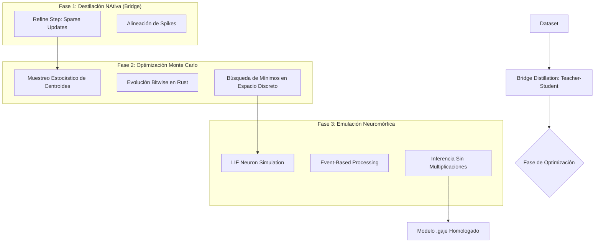

# 🧬 Protocolo de Destilación y Optimización SMG-1 (v0.9.5-alpha)

Este documento detalla el flujo técnico de transferencia de conocimiento desde un modelo Transformer Maestro hacia un motor Neuromórfico Estudiante (SMG-1), integrando optimización estocástica y simulación basada en eventos.

## 1. Arquitectura del Flujo Híbrido

El ecosistema v0.9.5-alpha no solo utiliza destilación directa, sino un pipeline de tres fases para superar la barrera de discretización de 2-bits.

## 2. Componentes de Optimización Avanzada

### A. Optimización por Monte Carlo (🎲)
Debido a que el espacio de 2-bits es discreto y los gradientes tradicionales se vuelven ruidosos, el flujo integra **Muestreo de Monte Carlo**.
*   **Función**: Genera perturbaciones aleatorias en los centroides (A, C, G, T) y evalúa la preservación de la entropía semántica.
*   **Uso**: Supera los mínimos locales donde el descenso de gradiente se queda "atascado" por la falta de resolución de los pesos.

### B. El Emulador de Spiking Transformer (🧠)
El modelo resultante no es solo una matriz de datos, sino un **Plano Genómico Ejecutable**.
*   **Modelo LIF (Leaky Integrate-and-Fire)**: Las capas SMG-1 emulan neuronas biológicas en Rust.
*   **Procesamiento Basado en Eventos**: La CPU solo trabaja cuando hay "disparos" (spikes), permitiendo manejar contextos masivos con un consumo energético mínimo.
*   **Zero Multiplications**: La inferencia se reduce a sumas de centroides pre-calculados, optimizando el throughput en procesadores ARM/Edge.

## 3. Homologación del Archivo .gaje

El formato `.gaje` actúa como el contenedor unificado (Homologación) para dos motores distintos:

1.  **Motor Transformer (GenomicLLM)**: Utiliza los datos del archivo para reconstruir pesos de alta precisión mediante de-cuantización genómica.
2.  **Motor Spiking (SMG-1)**: Utiliza los mismos datos como una red de impulsos binarios, operando directamente con los índices de 2-bits.

Esta **Homologación Genómica** permite que un mismo archivo de modelo sea "interpretado" de forma densa (precisión) o de forma neuromórfica (eficiencia) según la necesidad del dispositivo.

## 4. Funciones Críticas del Pipeline

*   `integrate_batch()`: Integración NEON de impulsos.
*   `refine_step()`: Actualización estocástica dirigida (Sparse).
*   `monte_carlo_centroids()`: Búsqueda global de estabilidad en los niveles de cuantización.
*   `check_spikes()`: Disparo y normalización genómica (GenomicNorm).

---
**Identificador de Versión**: 0.9.5-alpha
**Estado**: Protocolo Unificado de Optimización Estocástica.
