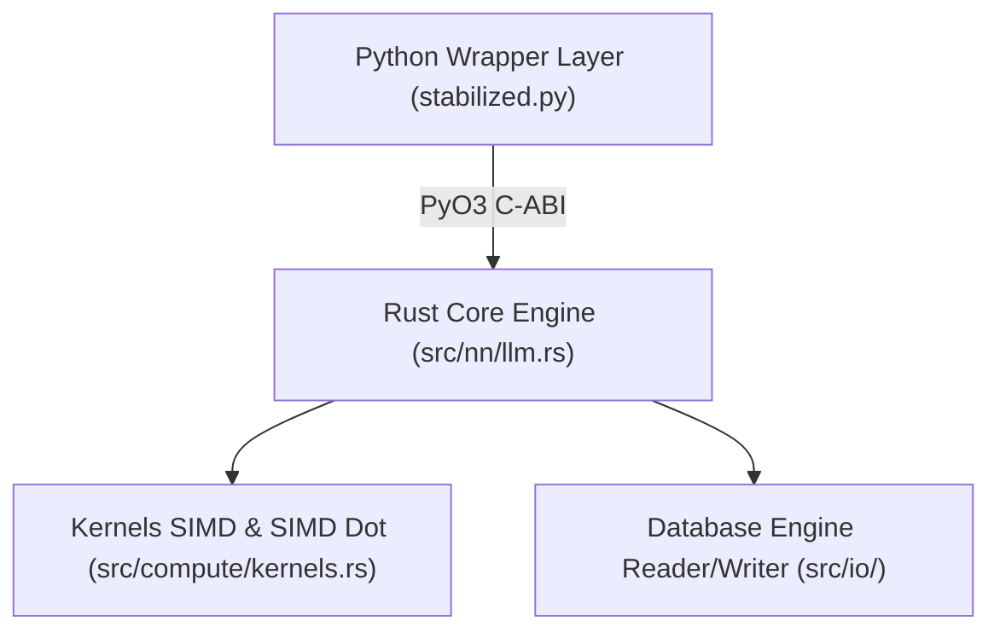

# 🏛️ Guía de Arquitectura Nativa GAJE-Flow

## 1. Visión General de la Arquitectura

El motor de inferencia nativa GAJE está estructurado en tres capas:

---

## 2. Componentes Principales en Rust (`src/`)

- **`src/nn/llm.rs` (`GenomicLLM`)**: Núcleo principal de inferencia que coordina la proyección de embeddings, la ejecución secuencial de bloques de transformador y la proyección `lm_head`.
- **`src/nn/block.rs` (`RustGenomicBlock`)**: Ejecuta una capa de transformador (Attention RMSNorm -> GQA Attention -> FFN RMSNorm -> SwiGLU FFN).
- **`src/nn/attention.rs` (`GenomicAttention`)**: Gestión de atención de consulta agrupada (GQA), incrustaciones posicionales rotacionales (RoPE) y caché de claves/valores (KV-Cache).
- **`src/nn/linear.rs` (`GenomicLinear`)**: Proyección lineal nativa con soporte para descuantización vectorizada de 4-bit / 2-bit sobre la marcha y Stability Anchors en FP16.
