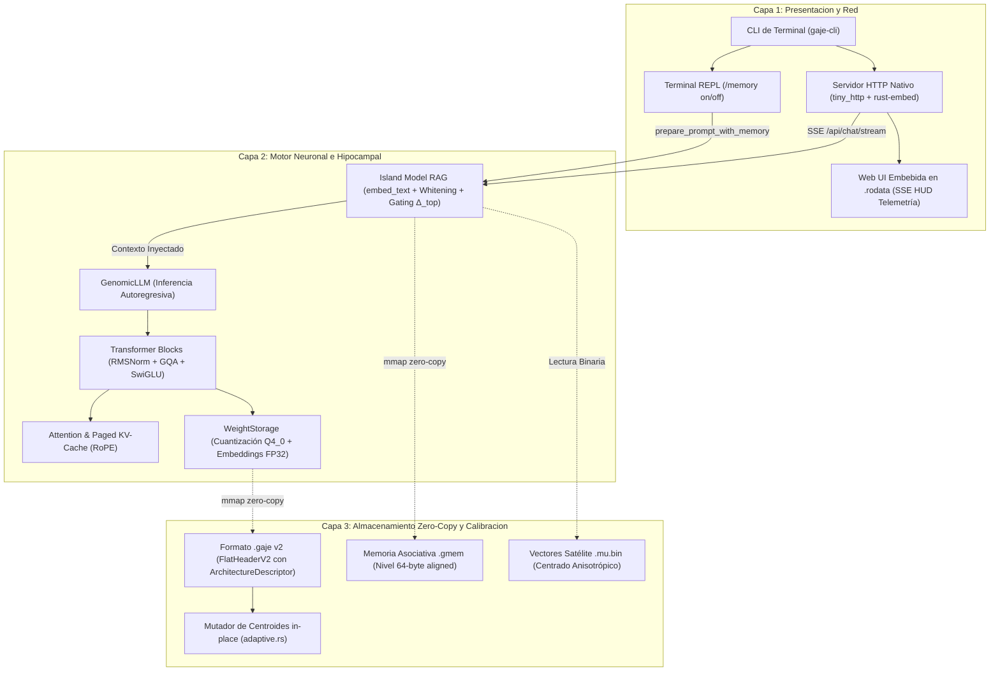

# 🏛️ Guía de Arquitectura del Sistema GAJE Helix (v1.7.4-alpha)

**Estado:** Estándar Oficial de Arquitectura del Repositorio  
**Fecha:** 2026-09-12  
**Gobernanza:** Soberanía Nativa en Rust (Zero-Python en Producción)

---

## 1. Visión General del Sistema

**GAJE (Genomic Adaptive Joint Embedding)** se distribuye y ejecuta como un **binario único soberano en Rust** (`gaje-cli`) de alto rendimiento, diseñado para ejecución local y en el borde (edge) con huella mínima de memoria viva (`mmap` zero-copy) e integración nativa de memoria persistente asociativa.

El sistema opera bajo una arquitectura desacoplada de tres capas estrictas:



---

## 2. Capas Arquitectónicas del Núcleo

### A. Capa 1: Presentación, Terminal y Red (`src/bin/`, `src/server/`, `src/cli/`)
1. **Ejecutable Soberano (`src/bin/gaje-cli.rs`)**:
   Punto de entrada único. Despacha comandos administrativos (`export-flat`, `benchmark`, `models`, `mutate`, `audit`, `doctor`) e interactivos (`chat`, `serve`).
2. **Servidor HTTP de Producción (`src/server/`)**:
   Implementado con `tiny_http` y `rust-embed`. Sirve la interfaz Web UI completa directamente desde la sección `.rodata` del ejecutable sin dependencias en disco.
   * **Streaming SSE Real**: Emisión fragmentada token-por-token con empaquetamiento de chunks y métricas HUD en vivo (`__gaje_metrics__`, TPS, latencia, DNA audit trail).
   * **Concurrencia Serializada Segura**: Controlada por un bloqueo de lectura/escritura (`active_model.write()`) que garantiza estabilidad térmica y cero condiciones de carrera en hardware modesto.
   * **Hot-Swap Dinámico**: Permite cambiar de modelo sobre la marcha (`/api/load_model`), desmapeando previamente la RAM del modelo anterior vía `munmap`.
   * **Cero Python en Runtime**: Auditado formalmente con `strace`, certificando cero subprocesos o llamadas a Python.

### B. Capa 2: Motor Neuronal y Memoria Hipocampal (`src/nn/`, `src/compute/`)
1. **Modelo Neuronal (`src/nn/llm/`)**:
   `GenomicLLM` orquesta la proyección de embeddings de entrada, el recorrido autorregresivo a través de los bloques y la proyección final de logits en `lm_head`.
2. **Capas Lineales y Almacenamiento (`src/nn/linear/storage.rs`)**:
   `WeightStorage` gestiona el formato binario plano con descuantización SIMD al vuelo. El cuerpo del modelo opera en **Q4_0** (16 centroides discretos optimizados) y las capas críticas de vocabulario (`token_embd` y `lm_head`) se preservan en **FP32**.
3. **Memoria Hipocampal RAG (`src/compute/island.rs`)**:
   Implementa la recuperación y persistencia de memoria contextual en tiempo real con latencias $<0.5\text{ ms}$:
   * **Extractor Semántico Ligero (`embed_text`)**: *Weighted Mean Pooling* sobre los embeddings de entrada ($W_E$) con atenuación de stopwords (peso 0.15) y exclusión de tokens especiales, sin inferencia de bloques del LLM.
   * **Centrado Anisotrópico (Whitening)**: Mitigación del colapso de cono vectorial en modelos de alta dimensión ($D \ge 576$) mediante vectores de centrado satélite $\boldsymbol{\mu}$.
   * **Gating de Brecha de Entropía ($\Delta_{top} \ge 0.12$)**: Inhibición lateral competitiva K-WTA unida a descarte estricto de consultas ambiguas para eliminar falsos positivos.
   * **Telemetría de 6 Estados**: Supervisión en vivo de decisiones (`memory_disabled`, `memory_empty`, `memory_dim_mismatch`, `memory_injected`, `rejected_low_similarity`, `rejected_entropy_gap`).
   * **Degradación Controlada (Opción C Fallback)**: En ausencia o corrupción del `.mu.bin`, conmuta automáticamente a $\tau^* = 0.50$ sin interrumpir la inferencia.

### C. Capa 3: E/S Mmap Zero-Copy y Formato Binario (`src/io/`)
1. **Formato Binario `.gaje` v2 (`FlatHeaderV2`)**:
   Cabecera fija alineada de 4096 bytes que incluye el descriptor dinámico de arquitectura (**`ArchitectureDescriptor`**). Define dimensiones, constantes de RoPE, esquemas de atención y linaje genético de mutaciones sin requerir ficheros de configuración externos.
2. **Memoria Persistente `.gmem` (`src/io/gmem.rs`)**:
   Índices binarios planos toroidales alineados a 64 bytes para arranque en frío ultrarrápido ($< 0.12\text{ ms}$) y lectura zero-copy de recuerdos clasificados por nichos (`documental`, `episódica`, `conversacional`).
3. **Mutación Genómica in-place (`src/io/adaptive.rs`)**:
   Permite actualizar centroides directamente sobre el fichero binario mmap sin reentrenar ni reescribir la matriz de pesos base.

---

## 3. Mapa Detallado del Código Fuente (`src/`)

```text
src/
├── bin/
│   └── gaje-cli.rs          # Punto de entrada soberano y despachador de comandos CLI
├── cli/                     # Capa de presentación y comandos de terminal
│   ├── models.rs            # Catálogo, inspección de cabeceras e historial de linaje
│   └── tools.rs             # Subcomandos de exportación, benchmark, mutación y auditoría
├── compute/                 # Núcleo numérico y de recuperación
│   ├── doctor.rs            # Diagnóstico de extensiones de CPU (AVX2, AVX512, NEON) y VRAM
│   ├── island.rs            # Orquestador RAG hipocampal, gating de entropía y telemetría
│   ├── lagrangian.rs        # Muestreo dinámico y osciladores toroidales
│   ├── sampling.rs          # Muestreo autorregresivo estándar (Top-P, Min-P, Temp, RepPenalty)
│   └── sintergic.rs         # Transductor sintergial de coherencia latente
├── core/                    # Estructuras base y tokenización
│   ├── gtok.rs              # Lector/escritor de vocabulario binario y plantillas de chat
│   └── tokenizer.rs         # Tokenizador soberano BPE/GTOK con soporte multilingüe
├── io/                      # E/S Mmap Zero-Copy
│   ├── adaptive.rs          # Mutador de centroides in-place con trazabilidad genética
│   ├── flat_reader.rs       # Lector binario zero-copy de FlatHeaderV2 (.gaje / .flat)
│   ├── flat_writer.rs       # Exportador y serializador paralelo Rayon hacia .gaje v2
│   ├── gguf/                # Parser nativo de modelos GGUF para transmutación
│   └── gmem.rs              # Motor de persistencia y búsqueda vectorial toroidal (.gmem)
├── nn/                      # Redes neuronales y bloques de transformador
│   ├── attention.rs         # Atención GQA, incrustaciones RoPE y gestión de KV-Cache
│   ├── block/               # Capa de transformador (RMSNorm -> GQA -> RMSNorm -> SwiGLU)
│   ├── linear/              # Almacenamiento y descuantización SIMD (WeightStorage Q4_0/FP32)
│   ├── llm/                 # GenomicLLM, pase forward y extractor semántico embed_text
│   └── repl.rs              # Bucle de interacción de chat interactivo en terminal
└── server/                  # Servidor HTTP nativo de producción
    ├── api.rs               # Endpoints REST (/api/models, /api/info, /api/memory)
    ├── mod.rs               # Servidor tiny_http, hot-swap de modelos y concurrencia
    ├── static_files.rs      # Despacho híbrido de Web UI embebida (.rodata) y disco local
    └── streaming.rs         # Despachador de streaming SSE en tiempo real token-por-token
```

---

## 4. Flujo Canónico de Inferencia con Memoria

```
1. Petición del Usuario (HTTP SSE o Terminal REPL)
       │
       ▼
2. Introspección Canónica de Plantilla (detect_chat_template_from_tokenizer)
       │
       ▼
3. prepare_prompt_with_memory (Fuente Única de Verdad)
       ├── Si use_memory == false -> Estado: memory_disabled
       └── Si use_memory == true:
             ├── Extraer vector semántico con embed_text(W_E, query) (< 0.5 ms)
             ├── Aplicar centrado anisotrópico con vector satélite .mu.bin
             ├── Recuperar candidatos en nichos documental, episódico y conversacional
             ├── Evaluar K-WTA competitive pruning (sim >= top * 0.90)
             └── Evaluar Gating de Brecha de Entropía (delta_top >= 0.12)
                   ├── Aceptado -> Inyectar dentro del bloque <|im_start|>system ... <|im_end|>
                   └── Rechazado -> Estado: rejected_entropy_gap o rejected_low_similarity
       │
       ▼
4. Tokenización BPE (GajeTokenizer)
       │
       ▼
5. Forward Pass por Bloques Transformer (GenomicLLM)
       │
       ▼
6. Emisión SSE Token-por-Token + Métricas HUD Finales (__gaje_metrics__)
```

---

*Arquitectura ratificada bajo el Protocolo GAJE Helix (Septiembre 2026).*
