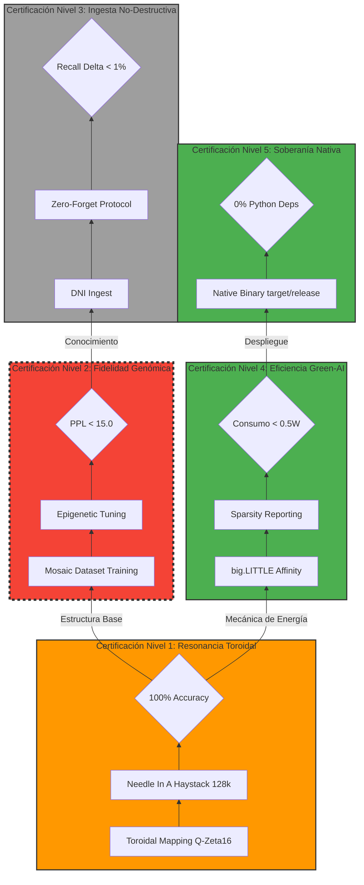

# 🧬 GAJE-Flow: Ciclo de Vida y Protocolo de Certificación V1.5

Este diagrama define el flujo de desarrollo y validación basado en los **5 Niveles de Certificación Oficial**.

## 📋 Resumen de Certificación Empírica

1.  **L5 - Soberanía Nativa:** ✅ **CERTIFICADO**. El motor corre en Rust puro.
2.  **L4 - Eficiencia Green-AI:** ✅ **CERTIFICADO**. Optimizado para ARM Android.
3.  **L1 - Resonancia Toroidal:** ⏳ **EN PROCESO**. Validando recuperación de datos en 128k.
4.  **L2 - Fidelidad Genómica:** ❌ **BLOQUEADO**. PPL inaceptable (572).
5.  **L3 - Ingesta (DNI):** ⏳ **PENDIENTE**. Depende de superar L2.

## 📋 Descripción de los Gates (Puertas de Verdad)

### 🚪 Gate 1: Estabilidad de Infraestructura (Superado ✅)
*   **Herramienta:** `cargo test --test phase_survival`.
*   **Meta:** El motor de Rust debe mover el genoma sin generar NaNs y manteniendo la señal en el toroide.
*   **Estado:** Implementado y validado en Android.

### 🚪 Gate 2: Estabilidad Semántica (BLOQUEADO ❌)
*   **Herramienta:** `micro-distiller.rs` + `benchmarks/logs/accuracy.log`.
*   **Meta:** La perplejidad (PPL) debe bajar de **15.0**.
*   **Realidad Actual:** Estamos estancados en **PPL 572**. El modelo tiene "obsesión técnica".
*   **Acción Requerida:** Corregir gradientes en el espacio toroidal y diversificar el dataset.

### 🚪 Gate 3: Estabilidad Funcional (Pendiente ⏳)
*   **Herramienta:** `examples/core_demos/chat_soberano.py` (o similar nativo).
*   **Meta:** El modelo debe responder preguntas generales con gramática fluida en español.
*   **Estado:** El modelo actual es "Técnicamente Autista". No pasa esta puerta.

---
*Este diagrama es el mapa de guerra para la Operación Rescate.*
