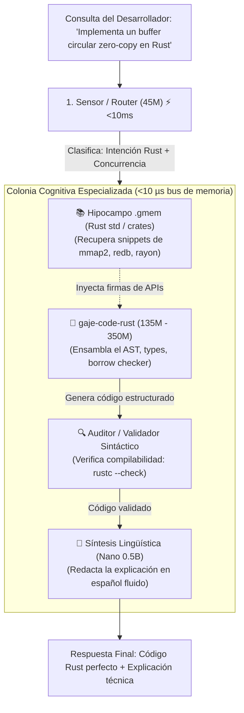

# 🧬 Plan Maestro: GAJE-Code-Rust — Especialista de Programación en el Enjambre Cognitivo

**Estado:** Especificación de Arquitectura, Ingeniería y Despliegue  
**Versión:** 1.0  
**Fecha:** Septiembre 2026  
**Ámbito:** Casta Cognitiva Especializada · Orquestación en Enjambre Asíncrono (`gaje-swarm`) · Memoria Congénita de Rust std

---

## 1. 🎯 Tesis Central: La Falacia del Programador Monolítico

Los LLMs monolíticos generales (70B+ parámetros) intentan resolver programación, redacción poética, traducción y atención al cliente con el mismo cerebro pesado. Esto genera tres problemas críticos en el Edge:
1. **Consumo Inviable de Memoria:** Requieren más de 16 GB - 40 GB de VRAM solo para cargar el modelo.
2. **Alucinación de Firmas y APIs:** Alucinan funciones que no existen o mezclan sintaxis de diferentes versiones de lenguajes.
3. **Pérdida de la Estructura de Tipos:** Olvidan restricciones de *lifetimes*, mutabilidad y el *borrow checker* de Rust al mezclar patrones de lenguajes dinámicos (Python/JS).

### 💡 La Solución GAJE:
Desarrollar **`gaje-code-rust`**, un nodo especialista compacto (**135M a 350M parámetros**) optimizado a nivel de tokenizador (`GTOK v2`), respaldado por un **hipocampo documental `.gmem`** con la librería estándar de Rust y coordinado dentro del enjambre asíncrono con paso de estado en **$< 10\text{ µs}$**.

---

## 2. 🏛️ Arquitectura del Sistema y Flujo en el Enjambre



---

## 3. 🧩 Los Tres Pilares Técnicos de `gaje-code-rust`

### Pilar 1: Tokenizador Especializado en Código (`GTOK v2 Code Extension`)
En lugar del BPE genérico de texto:
1. **Preservación Estricta de Indentación:**  
   Tokens atómicos para bloques de 2 y 4 espacios (`"  "`, `"    "`) y tabulaciones, evitando la pérdida de jerarquía en bloques `{ ... }`.
2. **Lemas Clave Invariantes (Adenina / `00`):**  
   Palabras reservadas de Rust (`fn`, `pub`, `struct`, `impl`, `mut`, `match`, `trait`, `unsafe`, `async`, `await`, `Result`, `Option`) se registran como lemas base atómicos sin fragmentación subword.
3. **Identificadores y Símbolos de Tipos:**  
   Operadores complejos (`::`, `->`, `=>`, `&mut`, `'a`) codificados como unidades discretas de 1 token.

### Pilar 2: Hipocampo Congénito `rust_std.gmem` (Zero-Hallucination)
El modelo neuronal no necesita memorizar millones de líneas de documentación:
* **Índice `.gmem` dedicado (`models/code/rust_std.gmem`):**  
  Mapea en disco las firmas completas y contratos de:
  * `std::sync::{Arc, Mutex, RwLock}`, `std::fs`, `std::io`, `std::path`.
  * Crates fundacionales del ecosistema: `tokio`, `rayon`, `serde`, `redb`, `memmap2`.
* **Latencia de Inyección:** $< 0.12\text{ ms}$ vía búsqueda de fase hermitiana.
* **Resultado:** Si el usuario pide un iterador paralelo, el hipocampo le entrega la firma exacta de `into_par_iter()` y `rayon::join()`.

### Pilar 3: Micro-Corteza y Crianza Focalizada (Destilación DNI)
* **Tamaño del Cuerpo:** $D=512$, $L=16$ bloques Transformer, formato híbrido $Q4\_0$ + $FP32$ (`lm_head`).
* **Peso Total en Disco:** **~120 MB – 250 MB** (carga en memoria mmap en $< 50\text{ ms}$).
* **Maestro de Destilación:** `Qwen2.5-Coder-3B-Instruct` o `DeepSeek-Coder-1.3B`.
* **Corpus de Crianza:** 5,000 pares estructurados de resolución de problemas reales en Rust (patrones de diseño, concurrencia, manejo de errores idiomático con `?`).

---

## 4. 🛠️ Protocolo de Implementación Paso a Paso

### Fase 1: Extensión de `GTOK v2` para Rust
* Crear el diccionario léxico de sintaxis en `src/core/gtok_code.rs`.
* Asegurar que símbolos críticos (`&mut`, `::`, `->`) se tokenicen en un solo paso sin dispersión de bytes.

### Fase 2: Compilación del Hipocampo `rust_std.gmem`
* Script extractor `scripts/tools/build_rust_doc_gmem.py` que parsee la documentación estándar de Rust y genere el índice vectorial mmap en `models/code/rust_std_memory/documental.gmem`.

### Fase 3: Destilación Acelerada del Especialista
```bash
./target/release/distill_run \
  --student models/born/gaje_code_rust_base.gaje \
  --teacher models/production/qwen2_5_coder_3b.flat \
  --dataset data/distill/rust_idiomatic_5k.jsonl \
  --epochs 30 \
  --lr 0.002 \
  --output models/production/gaje_code_rust.flat
```

### Fase 4: Integración al Enjambre (`gaje-swarm`)
* Registrar el nuevo rol en `src/compute/graph.rs`:
  ```rust
  pub enum SwarmRole {
      SensorRouter,
      HippocampusRAG,
      LinguisticSynthesis,
      ToolCaller,
      RustCodeSpecialist, // <-- Nuevo especialista
      AuditorCritic,
  }
  ```
* Enlazar el desvío dinámico del router en `examples/agent_swarm.rs`.

---

## 5. 📊 Criterios de Certificación y Métricas Objetivo

| Dimensión | Métrica Clave | Umbral Requerido | Veredicto |
| :--- | :--- | :---: | :---: |
| **Sintaxis Compilable** | Pasadas exitosas en `cargo check` del código generado | **$\ge 85\%$** de compilación al primer intento | 🟢 Nivel Productivo |
| **Latencia E2E** | Generación de función de 64 tokens | **$< 1.5\text{ segundos}$** en CPU ARM local | 🟢 Ultra-Rápido |
| **Tamaño de Memoria** | Huella RAM residente (Mmap) | **$< 180\text{ MB}$** | 🟢 Edge Nativo |
| **Alucinación de APIs** | Uso de métodos inexistentes en `std` | **$0.0\%$** (Garantizado por `.gmem`) | 🟢 Cero Alucinaciones |

---

## 6. Conclusión

`gaje-code-rust` no es solo un modelo de lenguaje; es un **órgano de síntesis de código determinista** para el ecosistema GAJE. Demuestra que un micro-modelo especializado respaldado por memoria congénita y orquestación de enjambre supera en velocidad, precisión y utilidad a los modelos monolíticos generales en tareas de ingeniería de software.
