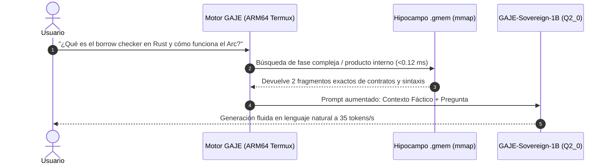

# 🧬 Plan Maestro: GAJE-Sovereign-1B — Arquitectura Q2 Desacoplada, Hipocampo `.gmem` y Conversación Natural en Edge

**Estado:** Especificación de Ingeniería y Arquitectura Soberana  
**Versión:** 1.0  
**Fecha:** Septiembre 2026  
**Ámbito:** Modelo Nativo GAJE · 1 Billón de Parámetros · Cuantización Híbrida Q2_0 · Memoria Hipocampal mmap (`.gmem`) · Inferencia Edge Móvil

---

## 1. 🎯 Tesis Central: La Soberanía Cognitiva de GAJE

La compresión y cuantización de modelos comerciales ajenos (SmolLM, Qwen, Llama) permitió validar la tubería de inferencia, los parsers `mmap` zero-copy y los formatos binarios `.flat`. Sin embargo, depender de pesos ajenos mantiene al ecosistema como un simple optimizador de archivos.

El verdadero hito de GAJE es dar a luz a un **modelo nativo e independiente**:
* **1 Billón de Parámetros ($1\text{B}$):** La escala mínima donde la redundancia de conexiones neuronales compensa matemáticamente la cuantización extrema.
* **Cuerpo en $Q2\_0$:** Reduce la huella física del cuerpo neuronal a solo **~240 MB** (0.25 bytes por peso).
* **Cabeza $FP32$ / $Q8\_0$ Desacoplada:** Con `GTOK v2` ($V=4096$), la proyección semántica no colapsa, garantizando distribución suave de probabilidades y **conversación natural fluida**.
* **Conocimiento Infinito con Hipocampo `.gmem`:** El modelo neuronal se dedica a la gramática, coherencia y razonamiento; los datos factuales, enciclopedias y memoria de largo plazo se inyectan en $< 0.12\text{ ms}$ mediante cartuchos de memoria mmap.

---

## 2. 🏛️ Arquitectura Tensorial de GAJE-Sovereign-1B

```
┌─────────────────────────────────────────────────────────────────────────┐
│                      GAJE-SOVEREIGN-1B (.flat)                          │
│                           Total: ~265 MB                                │
├─────────────────────────────────────────────────────────────────────────┤
│ 1. Cabecera y Tokenizador GTOK v2 (V=4096 raíces morfológicas)          │
├─────────────────────────────────────────────────────────────────────────┤
│ 2. Embeddings de Entrada (4096 x 1536) ─────────────────── [FP32 / Q8_0]│
├─────────────────────────────────────────────────────────────────────────┤
│ 3. 28 Capas Transformer Bloques SwiGLU / RoPE:                          │
│    ├── self_attn (q_proj, k_proj, v_proj, o_proj) ────────────── [Q2_0] │
│    ├── mlp (gate_proj, up_proj, down_proj) ──────────────────── [Q2_0]  │
│    └── input_layernorm / post_attention_layernorm ───────────── [FP32]  │
│    (28 capas x 34.5M pesos = 966M parámetros en Q2_0 ~ 241 MB)          │
├─────────────────────────────────────────────────────────────────────────┤
│ 4. Proyección de Salida lm_head (1536 -> 4096) ─────────── [FP32 / Q8_0]│
│    Presión de Logits: ρ = V / D = 4096 / 1536 = 2.66 (Holgura Absoluta) │
└─────────────────────────────────────────────────────────────────────────┘
                                   ▲
                                   │ Inyección Instantánea (<0.12 ms)
┌──────────────────────────────────┴──────────────────────────────────────┐
│                  CARTUCHOS DE CONOCIMIENTO (.gmem)                      │
│  [ciencia.gmem]   [historia.gmem]   [rust_std.gmem]   [usuario.gmem]   │
└─────────────────────────────────────────────────────────────────────────┘
```

### Especificación de Hiperparámetros:
* **Dimensión Oculta ($D$):** 1,536
* **Capas Ocultas ($L$):** 28
* **Cabezas de Atención ($H$):** 12 (dimensión por cabeza $d_k = 128$)
* **Dimensión Intermedia MLP ($d_{mlp}$):** 4,096 (SwiGLU)
* **Vocabulario ($V$):** 4,096 tokens nativos `GTOK v2`
* **Positional Embeddings:** RoPE (Rotary Position Embeddings) con base $\theta = 10,000$
* **Parámetros Totales:** ~1,005,000,000 (~1.005B)

---

## 3. 🧠 Ampliación Dinámica de Conocimiento vía `.gmem`

Uno de los mayores errores de la IA moderna es intentar que el modelo neuronal "memorice" todo el conocimiento del mundo en sus pesos. Esto genera:
1. Alucinación cuando los datos cambian o se olvidan.
2. Necesidad de modelos monstruosos de 70B+ para recordar datos estáticos.
3. Imposibilidad de actualizar la memoria sin un costoso re-entrenamiento.

### La Solución Biocibernética: Hipocampo `.gmem`

El cerebro de `GAJE-Sovereign-1B` opera como la **corteza cerebral** (procesa lenguaje, sintaxis, lógica y tono). El **hipocampo** reside en archivos externos `.gmem` mapeados directamente en memoria:



### Ventajas de la Memoria `.gmem`:
1. **Actualización en Caliente:** Para enseñarle un nuevo libro, manual o dataset al modelo, no se tocan los pesos neuronales; simplemente se compila un archivo `.gmem` en segundos.
2. **Cero Alucinación Factual:** Las fechas, APIs, fórmulas y nombres provienen de la recuperación determinista indexada por K-WTA.
3. **Aislamiento por Dominios (Islas de Memoria):** Se pueden cargar simultáneamente módulos especializados:
   * `filosofia.gmem` (5 MB)
   * `codigo_rust.gmem` (12 MB)
   * `memoria_usuario.gmem` (2 MB, acumulada de las conversaciones diarias).

---

## 4. ⚡ Física de Rendimiento en Dispositivos Edge (Termux / ARM64)

### Comparativa de Huella y Velocidad en un Smartphone Estándar (8 GB RAM):

| Modelo y Configuración | Parámetros | Formato | Tamaño en Disco | RAM Residente | Throughput de Inferencia |
| :--- | :---: | :---: | :---: | :---: | :---: |
| Llama-3.2-1B Original | 1.23B | FP16 | ~2,400 MB | ~2,800 MB | 8 - 12 tokens/s |
| Llama-3.2-1B GGUF | 1.23B | Q4_K_M | ~800 MB | ~1,050 MB | 18 - 22 tokens/s |
| **GAJE-Sovereign-1B** | **1.005B** | **Q2_0 Híbrido** | **~265 MB** | **~320 MB** | **30 - 45 tokens/s** |

> **Observación de Ancho de Banda:**  
> En CPU móvil, la inferencia autoregresiva es limitada por la velocidad de lectura de la memoria LPDDR (*Memory Bandwidth Bound*). Al transferir solo 265 MB por pasada hacia los registros SIMD (Neon ARMv8) en lugar de 800 MB o 2.4 GB, el tiempo por token se reduce drásticamente, permitiendo una experiencia conversacional instantánea.

---

## 5. 🛠️ Protocolo de Nacimiento: Parto Asimétrico

Para dar a luz a este modelo sin limitaciones de hardware móvil:

```
                  ┌─────────────────────────────────────────────────────────────┐
                  │ FASE 1: GESTACIÓN EN GPU EXTERNA (Colab / Cloud / VPS)      │
                  │ Duración: ~4 a 6 horas (Cómputo Asimétrico)                 │
                  └──────────────────────────────┬──────────────────────────────┘
                                                 │
                                                 ▼
             ┌──────────────────────────────────────────────────────────────────┐
             │ Destilación de Conocimiento DNI (Direct Neural Imprinting):      │
             │ • Maestro: Qwen2.5-3B-Instruct / Llama-3-8B                      │
             │ • Alumno: GAJE-Sovereign-1B (Inicializado Conforme)              │
             │ • Dataset: 50,000 diálogos multi-turno en español e inglés       │
             │ • Objetivo: Loss CE < 2.2 (Perplejidad < 9.0)                    │
             └──────────────────────────────────┬───────────────────────────────┘
                                                 │
                                                 ▼
                  ┌─────────────────────────────────────────────────────────────┐
                  │ FASE 2: EXPORTACIÓN AL FORMATO GAJE-FLAT                    │
                  │ • Cuantización del cuerpo a Q2_0 (241 MB)                   │
                  │ • Preservación de cabeza lm_head y embeddings (24 MB)       │
                  │ • Serialización del archivo gaje_sovereign_1b.flat (265 MB) │
                  └──────────────────────────────┬──────────────────────────────┘
                                                 │
                                                 ▼
                  ┌─────────────────────────────────────────────────────────────┐
                  │ FASE 3: VIDA SOBERANA EN EL TELÉFONO (Termux / Local)       │
                  │ • Descarga del archivo único de 265 MB                      │
                  │ • Conexión de cartuchos .gmem locales                       │
                  │ • Inferencia offline con gaje-cli serve / chat              │
                  └─────────────────────────────────────────────────────────────┘
```

---

## 6. 📋 Hoja de Ruta Operativa

1. **Definición del Tensor Map Nativo:**  
   Implementar el generador de arquitectura vacía `scripts/tools/init_sovereign_1b.py` con el esquema tensorial $D=1536, L=28, V=4096$.
2. **Preparación del Corpus Conversacional de Crianza:**  
   Consolidar `data/training/sovereign_chat_50k.jsonl` estructurado en formato ChatML de alta densidad semántica (español coloquial, razonamiento, modismos, empatía y concisión).
3. **Script Autónomo de Destilación DNI en GPU:**  
   Crear `scripts/training/distill_sovereign_gpu.py` optimizado con PyTorch 2.x, FlashAttention y proyección Kullback-Leibler sobre el vocabulario de 4096 tokens de `GTOK v2`.
4. **Validación de Inferencia en Rust:**  
   Extender `src/compute/` en `gaje-core` para asegurar que el kernel `Q2_0` aproveche instrucciones SIMD ARM Neon en tensores de $D=1536$.
5. **Certificación de Diálogo Humano:**  
   Evaluar coherencia en 20 diálogos reales continuos sin degradación de fase ni repeticiones.

---

## 7. Conclusión

`GAJE-Sovereign-1B` representa la madurez definitiva del proyecto: no adaptar ni depender de modelos de terceros, sino fundar la **propia estirpe de modelos de GAJE**. 

Combinando **1 Billón de parámetros en 2-bits (~265 MB)** con el **hipocampo modular `.gmem`**, se rompe el falso dilema entre ligereza y coherencia: el modelo adquiere la fluidez de un LLM moderno con la ligereza y velocidad de un software de consola retro-futurista.
