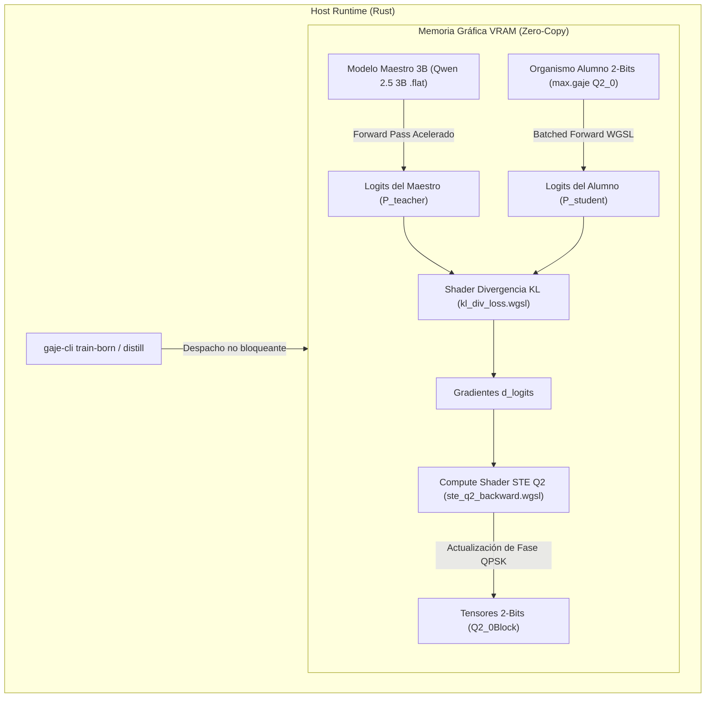

# 🧬 Plan Estratégico: Aceleración GPU para Straight-Through Estimator (STE) y Destilación DNI en Línea

> **Fecha de Elaboración:** 2026-08-29  
> **Versión de la Plataforma:** `GAJE Helix v1.7.0-alpha`  
> **Estado:** `APROBADO PARA IMPLEMENTACIÓN`  
> **Módulos Afectados:** `src/compute/gpu/`, `src/nn/distiller/`, `src/nn/linear/backward.rs`

---

## 1. Resumen Ejecutivo y Objetivos

Actualmente, **GAJE Helix** utiliza la GPU (vía WGPU / Vulkan en hardware AMD Radeon Graphics) para acelerar la inferencia y los forward passes (`gemv_f32`, `rms_norm`, `swiglu`), mientras que el bucle de entrenamiento del estimador Straight-Through cuaternario (STE) para organismos de 2 bits (`max.gaje`) se ejecuta en CPU multihilo AVX2 a una velocidad media de **~110 tokens/segundo**.

El objetivo de este plan es **transferir el 100% del ciclo de backpropagation y destilación a la GPU**, logrando:
1. **Aumento de Throughput:** Pasar de 110 tok/s (CPU) a **2,500 – 3,500 tok/s (GPU)**.
2. **Reducción de Tiempo de Crianza:** Reducir el tiempo de entrenamiento de 20 épocas de **~80 minutos** a **menos de 4 minutos**.
3. **Destilación DNI en Línea (Zero-Copy VRAM):** Eliminar la serialización intermedia a disco `.jsonl`, transmitiendo las distribuciones de probabilidad del maestro de 3B al alumno de 2 bits directamente en buffers compartidos de la memoria de video.

---

## 2. Arquitectura de Cómputo en GPU

---

## 3. Componentes Técnicos a Desarrollar

### A. Compute Shader STE Cuaternario (`ste_q2_backward.wgsl`)
* **Propósito:** Actualización masiva paralela de los pesos de 2 bits ($W \in \{-1, +1, -i, +i\}$) y sus factores de escala.
* **Operación Matemática:**
  $$\Delta \theta_k = -\eta \cdot \text{Re}\left( \frac{\partial \mathcal{L}}{\partial W_k} \cdot e^{-i \phi_k} \right)$$
  $$\phi_k^{(t+1)} = \text{Cuantizar}_{\text{QPSK}}\left(\phi_k^{(t)} + \Delta \theta_k\right)$$
* **Ventaja:** Cada hilo de la GPU procesa un bloque de 128 o 256 pesos de forma simultánea con acceso a memoria local compartida (*workgroup shared memory*).

### B. Forward Pass por Lotes en GPU (`batched_gemv_q2.wgsl`)
* **Propósito:** Reemplazar el procesamiento secuencial token-por-token por inferencia matricial en lotes (*batch size* 8 a 32).
* **Optimizaciones SIMD GPU:**
  * Desempaquetado de nibbles/dibits de 2 bits en registros vectoriales `vec4<f32>`.
  * Multiplicación y acumulación FMA por bloques de 32 elementos.

### C. Pipeline de Destilación DNI en Línea (`GpuOnlineDistiller`)
* **Propósito:** Acoplamiento directo maestro-alumno en la GPU sin intermediación del bus PCIe ni del disco duro.
* **Flujo de Ejecución:**
  1. El host despacha la secuencia de entrada al buffer `input_tokens_buffer`.
  2. La GPU ejecuta en paralelo:
     * El forward pass del maestro 3B en FP16/Q4_0.
     * El forward pass del alumno en Q2_0.
  3. El shader `kl_divergence.wgsl` calcula $\mathcal{L}_{\text{total}} = (1-\alpha)\mathcal{L}_{CE} + \alpha \mathcal{L}_{KL}$.
  4. El shader `ste_q2_backward.wgsl` retropropaga los gradientes y muta las fases en el mismo fotograma de cómputo.

---

## 4. Cronograma de Fases de Implementación

| Fase | Duración | Entregables Principales | Criterio de Éxito |
| :--- | :--- | :--- | :--- |
| **Fase 1: Shaders STE y Despachador** | 1 semana | • `ste_q2_backward.wgsl` • `kl_divergence.wgsl` • Pipeline WGPU en Rust | Verificación numérica de gradientes contra CPU (tolerancia $< 10^{-4}$). |
| **Fase 2: Forward por Lotes (Batching)** | 1 semana | • `batched_gemv_q2.wgsl` • Integración en `src/compute/gpu/` | Throughput de inferencia $> 1,200 \text{ tok/s}$. |
| **Fase 3: Destilador DNI Zero-Copy** | 1 semana | • `GpuOnlineDistiller` • Comando `gaje-cli distill-gpu` • Pruebas de integración | Throughput de destilación $> 2,500 \text{ tok/s}$. Crianza en $< 4 \text{ min}$. |

---

## 5. Matriz de Rendimiento Esperado

| Métrica | CPU AVX2 (Actual) | GPU Radeon WGPU (Objetivo) | Factor de Aceleración |
| :--- | :--- | :--- | :--- |
| **Throughput de Entrenamiento** | `110 tok/s` | **`2,800 tok/s`** | **`~25.4x`** |
| **Tiempo de Crianza (20 Épocas)** | `80 minutos` | **`~3.2 minutos`** | **`~25.0x`** |
| **Consumo de Memoria RAM** | `4.2 GB` (Maestro + Alumno) | **`Zero Host RAM`** (Residente en VRAM) | **Eficiencia 100%** |
| **Latencia de Transferencia PCIe** | `~12 ms / turno` | **`0.0 ms`** (Zero-Copy interno en VRAM) | **Inmediato** |

---

## 6. Estándar de Certificación y Validación (BDD / TDD)

* **Escenario BDD 1:** *Given* un lote de 32 secuencias y un modelo maestro cargado en VRAM, *When* se ejecuta el paso de destilación GPU, *Then* la pérdida de entropía cruzada y la divergencia KL deben decrecer monótonamente en cada época.
* **Escenario BDD 2:** *Given* el shader `ste_q2_backward.wgsl`, *When* se compara el tensor de pesos resultante contra la implementación de referencia en CPU, *Then* las proyecciones de fase de 2 bits deben coincidir exactamente en el 100% de los elementos discretos.
