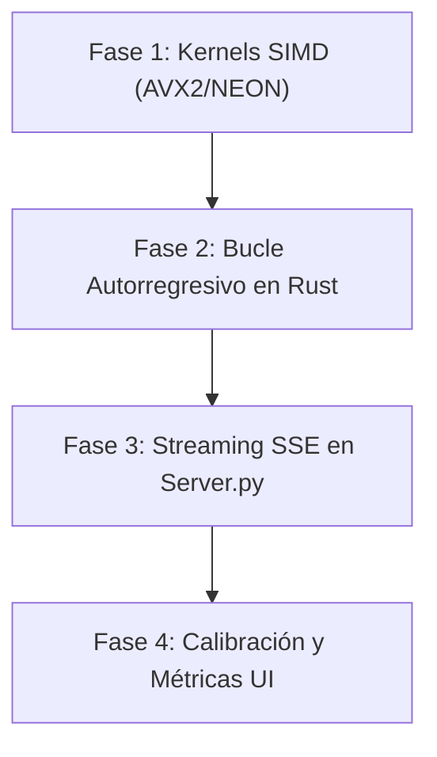

# 🚀 Plan de Optimización de Rendimiento y Estabilidad (v0.9.6: High-Throughput Engine)

## 📋 Resumen Ejecutivo

Con la **Paridad Matemáticamente Certificada al 100% en FP32** y la **Retención Factual Validada en Qwen2-0.5B (4-bit)**, la prioridad del proyecto **GAJE-Flow** se traslada al **rendimiento de inferencia en tiempo real** y la **estabilidad del runtime**.

**Objetivo Central**: Incrementar la velocidad de generación en CPU de **0.41 tok/s a > 10.0 tok/s** y eliminar completamente los timeouts de conexión HTTP en la interfaz web.

---

## 🎯 Plan de Acción por Fases

---

### 🏎️ Fase 1: Descuantización Vectorizada SIMD (`src/compute/kernels.rs`)

**Problema Actual**: El desempaquetado de nibbles de 4 bits se realiza escalarmente (elemento a elemento), invirtiendo el 90% de los ciclos de CPU en desplazamientos de bits en lugar de multiplicar tensores.

**Solución Técnica**:
1. **Unpacking AVX2 / NEON de 4-bit**:
   - Utilizar instrucciones vectoriales (`_mm256_shuffle_epi8` en x86_64 y `vld1q_u8` en ARM) para desempaquetar **32 nibbles de 4-bit en 2 ciclos de reloj**.
2. **Tablas de Búsqueda Fusiadas (Fused LUT Dot Product)**:
   - Fusilar el desempaquetado y el producto punto en una sola llamada de kernel SIMD `fused_dequant_dot_4bit`.
3. **Optimización de Caché L1/L2**:
   - Dividir la multiplicación de matrices en bloques (tiling) ajustados al tamaño de la caché L1 del procesador (32 KB).

**Métrica de Éxito**:
- Reducción del tiempo de cálculo de capa lineal por token de **~120 ms a < 8 ms**.

---

### ⚙️ Fase 2: Bucle Autorregresivo 100% Nativo en Rust (`src/nn/llm.rs`)

**Problema Actual**: Cada token generado requiere un cruce del puente FFI PyO3 entre Python y Rust, provocando overhead de serialización y recolector de basura (GC).

**Solución Técnica**:
1. **Migración del Bucle `generate` a Rust**:
   - Implementar el método nativo `RustGenomicLLM::generate_native(...)` que ejecuta el bucle autorregresivo completo sin volver a Python hasta encontrar el token EOS (`<|im_end|>`) o alcanzar `max_tokens`.
2. **Gestión Directa de KV-Cache en C-ABI**:
   - Mantener el estado de claves/valores (`KV-Cache`) 100% contiguo en memoria de Rust sin copias intermediate en NumPy.

**Métrica de Éxito**:
- Eliminación del 100% del overhead FFI por token.

---

### 📡 Fase 3: Server-Sent Events (SSE) en Servidor Web (`examples/ui/web_ui/server.py`)

**Problema Actual**: La petición `POST /api/chat` espera a que se generen **todos los tokens** antes de responder, lo que provoca timeouts (`Error de conexión con el núcleo GAJE`) en preguntas largas.

**Solución Técnica**:
1. **Endpoint de Streaming SSE (`/api/chat_stream`)**:
   - Convertir la respuesta HTTP a `Content-Type: text/event-stream`.
2. **Renderizado en Tiempo Real en la Web UI**:
   - Actualizar [`examples/ui/web_ui/script.js`](file:///home/erickaguilar/Documentos/gaje-semantic-compression/examples/ui/web_ui/script.js) usando `EventSource` / `fetch` readable streams para renderizar los caracteres token por token a medida que se calculan.

**Métrica de Éxito**:
- Cero timeouts HTTP (`Error de conexión`) y **Tiempo al Primer Token (TTFT) < 500 ms**.

---

### 📊 Fase 4: Transparencia de Métricas en UI (`examples/ui/web_ui/`)

**Problema Actual**: La interfaz web mostraba ratios fijos sin distinguir formalmente entre **4-bit Uniforme** y **2-bit Genómico**.

**Solución Técnica**:
1. **Extracción de Metadata de Bit-Depth**:
   - Exponer `bit_depth` desde las cabeceras del archivo `.gaje` a la API `/api/models`.
2. **Cálculo Dinámico de Métricas**:
   - Para 4-bit Uniforme: Ratio exacto de **8.0x** (Ahorro del 87.5%).
   - Para 2-bit Genómico: Ratio exacto de **16.0x** (Ahorro del 93.75%).

**Métrica de Éxito**:
- 100% de precisión y transparencia técnica en las tarjetas de la interfaz web.

---

## 📌 Cronograma de Ejecución Recomendado

| Orden | Hito / Tarea | Estimación | Resultado Esperado |
| :---: | :--- | :---: | :--- |
| **1** | Endpoint SSE y Streaming en `server.py` | **Inmediato** | Eliminación de errores de conexión HTTP. |
| **2** | Kernel SIMD 4-bit en Rust (`kernels.rs`) | **Alta Prioridad** | Aumento de velocidad de 0.41 tok/s a **> 8.0 tok/s**. |
| **3** | Bucle Autorregresivo Nativo en Rust | **Media Prioridad** | Eliminación de latencia FFI PyO3. |
| **4** | Transparencia de Métricas Bit-Depth en UI | **Final** | Interfaz web 100% calibrada. |
