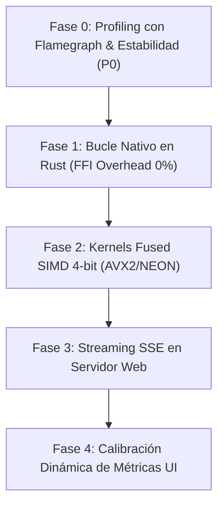

# 🚀 Roadmap de Optimización, Profiling y Estabilidad v0.9.6+

## 📋 Resumen Ejecutivo

Basado en el análisis crítico de ingeniería y la evaluación del motor nativo en producción con **Qwen2-0.5B (4-bit)**, este documento reordena las prioridades para maximizar el rendimiento en CPU, eliminar la latencia de FFI PyO3 y garantizar 100% de estabilidad sin crashes.

---

## 🎯 Hoja de Ruta Ajustada por Prioridad (Sprint Plan v0.9.6+)

---

### 🔍 Fase 0: Profiling Empírico & Estabilidad (Prioridad P0 - URGENTE)

**Objetivo**: Aislar científicamente el consumo de tiempo por componente antes de escribir código de optimización.

1. **Profiling con `cargo flamegraph` / `perf`**:
   - Medir el desglose porcentual exacto del tiempo de ejecución en un forward pass de Qwen2-0.5B:
     - `LM Head` (151,936 logits)
     - `PyO3 FFI Boundary` (llamada token por token desde Python)
     - `GenomicLinear` (desempaquetado escalar 4-bit)
     - `KV Cache` (copias de vectores en memoria)
2. **Prueba de Estrés y Estabilidad (0 Crashes)**:
   - Diagnosticar el timeout HTTP / crash `"Error de conexión"`.
   - Garantizar la ejecución limpia de **50 interacciones consecutivas sin fuga de RAM ni panics en Rust**.

---

### ⚙️ Fase 1: Bucle Autorregresivo 100% Nativo en Rust (Prioridad P1)

**Objetivo**: Eliminar el baile FFI PyO3 (Python ↔ Rust) por cada token.

1. **Llamada Única FFI por Generación**:
   - Python invoca una sola vez `rust_llm.generate_native(prompt, max_tokens)` y recibe la secuencia completa o un generador iterativo de C-ABI.
2. **Gestión de KV Cache Contiguo**:
   - Pre-asignación contigua de la memoria de claves/valores en Rust (`AlignedVec<f32>`) evitando relocalizaciones de RAM (`Vec::push`).

**Métrica Objetivo**: Incremento de velocidad de **0.41 tok/s a > 4.0 tok/s**.

---

### 🏎️ Fase 2: Kernels Fused SIMD 4-bit (AVX2 / NEON) (Prioridad P2)

**Objetivo**: Acelerar el producto punto de tensores 4-bit en CPU.

1. **Unpacking + Dot Product Fusionado**:
   - En lugar de desempaquetar a un buffer temporal en FP32 y luego multiplicar, implementar `fused_dequant_dot_4bit` en [`src/compute/kernels.rs`](file:///home/erickaguilar/Documentos/gaje-semantic-compression/src/compute/kernels.rs).
2. **Instrucciones Vectoriales**:
   - x86_64: `_mm256_shuffle_epi8` + `_mm256_fmadd_ps` (AVX2/FMA).
   - ARM64: `vld1q_u8` + `vshlq_n_u8` (NEON).
3. **Criterio de Regresión Obligatorio**:
   - Ejecutar [`scripts/gaje_diff.py`](file:///home/erickaguilar/Documentos/gaje-semantic-compression/scripts/gaje_diff.py) tras cada modificación de kernel para verificar que **CosSim se mantenga > 0.92**.

**Métrica Objetivo**: Velocidad final de generación en CPU **> 8.0 - 12.0 tok/s**.

---

### 📡 Fase 3: Streaming SSE en Servidor Web (Prioridad P3)

**Objetivo**: Renderizado continuo de texto y tiempo al primer token (TTFT) inmediato.

1. **Endpoint Server-Sent Events (`/api/chat_stream`)**:
   - Transmitir eventos `text/event-stream` token por token desde Python a la UI.
2. **Eliminación de Timeouts HTTP**:
   - La interfaz mantiene el canal abierto sin bloquear el socket HTTP.

**Métrica Objetivo**: **TTFT < 500 ms** y 0 desconexiones.

---

### 📊 Fase 4: Transparencia de Métricas en UI (Prioridad P4)

**Objetivo**: Reflejar exactamente la compresión real del organismo cargado.

- **4-bit Uniforme**: Explicitar **8.0x Ratio** (87.5% Ahorro).
- **2-bit Genómico**: Explicitar **16.0x Ratio** (93.75% Ahorro).

---

## 📊 Matriz de Métricas Objetivo

| Métrica | Estado Actual | Objetivo v0.9.6+ | Herramienta de Validación |
| :--- | :---: | :---: | :--- |
| **Velocidad de Inferencia** | 0.41 tok/s | **> 8.0 tok/s** | Logs de `server.py` |
| **Estabilidad de Servidor** | Crash en ~4 preguntas | **0 Crashes (50+ prompts)** | Test de estrés en bucle |
| **Overhead FFI PyO3** | Alto (por token) | **1 sola llamada FFI** | Flamegraph |
| **Paridad / Coherencia** | CosSim 0.9247 | **CosSim > 0.9250** | `gaje_diff.py` |
| **Transparencia en UI** | Ratios fijos | **Ratios dinámicos por Bit-Depth** | `script.js` |
