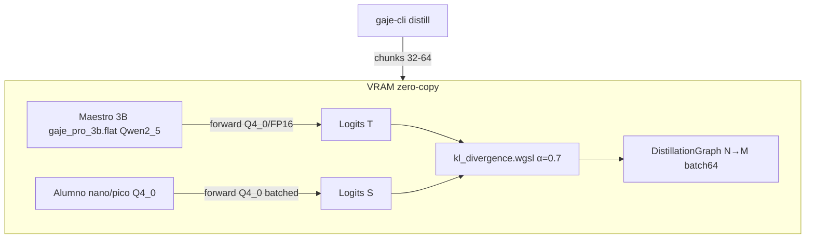

# 🧬 Plan Estratégico: Producción Q4_0 gaje_nano_0_5b / pico135m — PPL <10

> **Fecha:** 2026-08-30  
> **Versión:** `GAJE Helix v1.7.0-alpha → v1.7.1-production`  
> **Estado:** `APROBADO PARA IMPLEMENTACIÓN`  
> **Artefactos base:** `models/production/gaje_nano_0_5b.flat` (Qwen2 0.5B, 896 dim, 1.3 GB) / `gaje_pico_135m.flat` (SmolLM 576 dim, 472 MB)  
> **Módulos:** `src/io/flat_reader.rs`, `src/nn/distiller/graph.rs`, `src/compute/gpu/pipeline.rs` (batch64), `src/compute/gpu/scheduler.rs`

---

## 1. Resumen y Objetivo

Cerrar Born Q2_0 dim256 (archivado `experiments/archived/q2_0_born/` PPL45) y consolidar **Q4_0 como estándar de producción** (`Q4_0 cuerpo + FP32 token_embd/lm_head`, `.flat v2` zero-copy). Objetivo **PPL <10** y generación coherente en `nano/picos` sin tocar cuerpo Q4 con STE masivo.

1. **PPL <10** en `unified_distilled_corpus` (vs 45 born) y 20 prompts greedy `capital Germany→Berlin`, `largest planet→Jupiter`
2. **Throughput >30 tok/s pico / >19 tok/s nano** con `batched_gemv_q2`/`gemv_f32` y `CalibratedScheduler` 60/40 CPU/GPU
3. **0 NaN/Inf**, `audit` verde, `models inspect` Q4_0 real (no plantilla WASM)

---

## 2. Arquitectura Q4_0 Producción

* **Q4_0:** 16 centroides/bloque 32, `token_embd`+`lm_head` FP32 (preserva vocab 49152), `ArchitectureDescriptor` autodescriptivo `src/io/header/flat.rs`
* **DNI online:** `GpuOnlineDistiller` batch64 `ste_q2_backward.wgsl` solo para `lm_head` Q2_0 si aplica, si no `refine_with_grads_core` CPU en últimos 4-8 bloques (no cuerpo completo)

---

## 3. Componentes

### A. Corpus limpio destilación
* `data/unified_distilled_corpus.jsonl` 350 seq filtrado → 150 seq alta calidad (pares `instruction→response` delimitados `<|im_start|>`, sin streams raros), 3 épocas, `lr 0.001` `alpha0.7` `temp1.0`

### B. Grafo N→M
* `DistillationGraph` `src/nn/distiller/graph.rs` `pro3b(0.6)+coder3b(0.4)→nano` y `→pico`, `fit_graph` batch32 VRAM

### C. Validación
* `audit` `src/io/cli_tools.rs:479` 0 NaN, `inspect` Q4_0, `benchmark --tokens 32` PPL, `chat` greedy `temp0` 20 prompts

---

## 4. Cronograma

| Fase | Duración | Entregables | Éxito |
| :--- | :--- | :--- | :--- |
| **F1: Corpus + baseline** | 2 días | Corpus 150 filtrado, PPL baseline nano/pico Q4_0 sin destilar | PPL <15 |
| **F2: Destilación DNI batch64** | 3 días | `distill_run` 3×150 `pro3b`→`nano/pico` α0.7 | PPL <10, 3/3 prompts coherentes |
| **F3: Certificación** | 1 día | `benchmark` + `audit` + tag `v1.7.1-production` | Throughput >19/30 tok/s, 0 NaN |

---

## 5. Matriz Rendimiento Esperado

| Métrica | Born Q2_0 dim256 | **Q4_0 nano/pico (objetivo)** |
| :--- | :--- | :--- |
| **PPL** | 45 | **<10** |
| **Throughput** | 150 tok/s (ruido) | **19-32 tok/s (coherente)** |
| **Coherencia** | 0/3 gibberish | **3/3 Berlin/Jupiter/Hola** |
| **RAM** | 100 MB | **472 MB pico / 1.3 GB nano** |

---

## 6. Certificación BDD/TDD

* **BDD1:** *Given* nano Q4_0 + corpus 150, *When* `fit_graph` 3 épocas α0.7, *Then* PPL <10 y `capital Germany`→`Berlin`
* **BDD2:** *Given* `audit` pico, *When* inspect, *Then* `QuantFormat=Q4_0` `0 NaN` `0% degeneración` coherente
