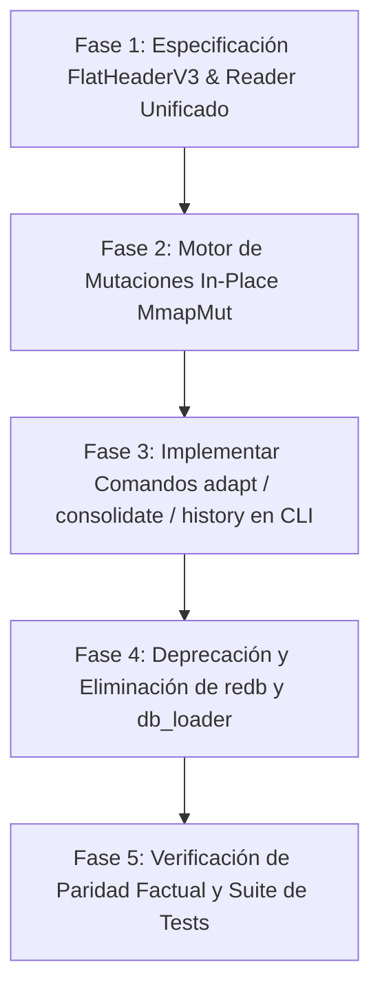

# 🧬 Plan de Arquitectura: Unificación en Formato Único `.gaje` v2 (Organismo Adaptativo Zero-Copy)

> **Ubicación en el repositorio:** [`docs/plans/UNIFIED_GAJE_ADAPTIVE_FORMAT_PLAN.md`](file:///data/data/com.termux/files/home/develop/gaje-semantic-compression/docs/plans/UNIFIED_GAJE_ADAPTIVE_FORMAT_PLAN.md)  
> **Estado:** 📝 En Revisión / Propuesto  
> **Objetivo:** Unificar los formatos `.gaje` (base redb) y `.flat` (binario zero-copy) en un único estándar binario nativo **`.gaje` v2**. Eliminar la dependencia de `redb` y dotar al archivo de capacidades de adaptación continua (mutaciones, SPSA in-place y deltas genómicos) sin duplicar pesos en disco.

---

## 1. 🎯 Diagnóstico y Objetivos

### El Problema Actual
1. **Fragmentación Cognitiva y de Tooling:** Existen dos formatos de pesos (`.gaje` y `.gaje.flat`), obligando al usuario a usar `gaje-cli export-flat` para poder hacer inferencia.
2. **Deuda Técnica y Dependencias Pesadas:** Se mantiene `redb` (~40K líneas de código compiladas) y `lz4_flex` únicamente para leer checkpoints antiguos en `src/core/db.rs` y `src/io/db_loader/`.
3. **Rigidez de `.flat` v2:** Aunque `.flat` es ultrarrápido ($< 0.75\text{ ms}$ mmap), actualmente está diseñado como un bloque inmutable de solo lectura. Para realizar un ajuste o mutación, es necesario reescribir todo el archivo binario de 1–5 GB.

### La Solución (Opción B: Organismo Adaptativo)
* **Un Solo Archivo (`.gaje`):** Formato binario plano nativo con acceso zero-copy vía `mmap`.
* **Cero Dependencias Externas de BD:** Eliminación total de `redb` y simplificación de E/S.
* **Capacidad Adaptativa Integrada:** Reserva estructurada dentro de la cabecera para **Deltas Genómicos (Sparse Overrides)** y **Registro de Mutaciones (Append-Only Log)**, permitiendo que el modelo aprenda y mute *in-place* sin reescribir sus matrices base.

---

## 2. 🏗️ Layout Binario del Formato Unificado `.gaje` v2

El archivo `.gaje` estará alineado a páginas del sistema operativo (4096 bytes) con 4 secciones claramente delimitadas:

```
┌─────────────────────────────────────────────────────────────────────────┐
│                    ESPECIFICACIÓN BINARIA: .gaje v2                    │
├─────────────────────────────────────────────────────────────────────────┤
│ 1. FlatHeaderV3 (4096 bytes fijos)                                      │
│    - Magic b"GAJE", versión 3, descriptor de arquitectura               │
│    - Offsets y longitudes a Metadatos, Tokenizador, Pesos y Adaptación  │
├─────────────────────────────────────────────────────────────────────────┤
│ 2. Tokenizador Embebido GTOK (Variable, alineado a 64 bytes)            │
│    - Vocabulario y merges para inferencia soberana sin dependencias     │
├─────────────────────────────────────────────────────────────────────────┤
│ 3. Bloque de Pesos Base (Contiguo, Q4_0 + FP32, Zero-Copy Mmap)         │
│    - Matrices de atención y FFN cuantizadas a 4-bits                    │
│    - Embeddings críticos y cabezas de salida en FP32                    │
├─────────────────────────────────────────────────────────────────────────┤
│ 4. Sección de Adaptación Genómica (Genome / Deltas / Linaje)             │
│    - [A] Tabla de Sparse Overrides (índices y deltas de pesos)          │
│    - [B] Log Cronológico de Mutaciones / Pasos SPSA (Append-Only)       │
│    - [C] Hash de Integridad y Linaje Genealógico                        │
└─────────────────────────────────────────────────────────────────────────┘
```

### Extensión de la Cabecera (`FlatHeaderV3`):
Aprovechando los 4000 bytes reservados en `FlatHeaderV2`:

```rust
#[repr(C)]
pub struct FlatHeaderV3 {
    // === CAMPOS HISTÓRICOS IDENTIFICACIÓN (12 bytes) ===
    pub magic: [u8; 4],           // b"GAJE"
    pub version: u32,             // 3
    pub flags: u32,               // Flags de estado (read-only, adaptive, sealed)
    pub num_tensors: u32,

    // === METADATOS Y OFFSETS BASE (48 bytes) ===
    pub meta_len: u64,
    pub dir_len: u64,
    pub weights_offset: u64,
    pub weights_len: u64,
    pub group_size: u32,
    pub quant_format: u32,
    pub arch_family: u32,
    pub arch_n_embd: u32,
    pub arch_n_head: u32,
    pub arch_n_head_kv: u32,
    pub arch_n_blocks: u32,
    pub arch_qk_permute: u32,
    pub gtok_offset: u64,
    pub gtok_len: u64,

    // === NUEVA SECCIÓN DE ADAPTACIÓN GENÓMICA (64 bytes) ===
    pub adapt_offset: u64,        // Offset al bloque genómico mutable
    pub adapt_len: u64,           // Longitud asignada al bloque
    pub num_overrides: u32,       // Cantidad de deltas/pesos sobreescritos activos
    pub num_mutations: u32,       // Cantidad de mutaciones registradas en el historial
    pub lineage_parent_hash: u64, // Hash del organismo ancestro
    pub lineage_current_hash: u64,// Hash actual verificado
    pub adapt_flags: u32,         // bit 0: Deltas activos, bit 1: SPSA habilitado
    pub _pad_adapt: u32,

    // === RESERVA RESTANTE (3888 bytes) ===
    pub reserved: [u8; 3888],
}
```

---

## 3. 🛠️ Herramientas Adaptativas a Implementar en `gaje-cli`

Con el nuevo formato `.gaje` adaptativo, se habilitan herramientas nativas que operan directamente sobre el archivo binario:

### 1. `gaje-cli adapt --model <path.gaje> --spsa-steps <N> --dataset <corpus.jsonl>`
* **Qué hace:** Ejecuta calibración o fine-tuning de orden cero (SPSA) en capas específicas (o anclas FP32).
* **Cómo opera:** Abre el archivo `.gaje` con `MmapMut` y escribe los deltas en la Sección 4 sin alterar los pesos base congelados.
* **Ventaja:** El ajuste toma segundos y añade unos pocos kilobytes al archivo en lugar de generar una copia de 2 GB.

### 2. `gaje-cli mutate --model <path.gaje> --target-layer <L> --intensity <sigma>`
* **Qué hace:** Inyecta perturbaciones genéticas dirigidas en tensores de nicho (DNI).
* **Cómo opera:** Registra la mutación en el log append-only y aplica los deltas estocásticos en la tabla de overrides.

### 3. `gaje-cli consolidate --model <path.gaje> [--output <nuevo.gaje>]`
* **Qué hace:** "Hornea" los deltas acumulados directamente sobre los pesos base de la Sección 3, recalculando los centroides y vaciando la sección de deltas para dejar el archivo 100% limpio y optimizado para inferencia final.

### 4. `gaje-cli history --model <path.gaje>`
* **Qué hace:** Muestra el árbol genealógico del modelo: qué mutaciones ha recibido, en qué fecha, el cambio de pérdida (loss/perplejidad) asociado y el linaje de sus ancestros.

---

## 4. 🧹 Elementos a Eliminar (Limpieza de Código)

La adopción de este estándar permite erradicar código legacy redundante:

| Componente a Eliminar | Ubicación | Justificación |
| :--- | :--- | :--- |
| **Crate `redb`** | `Cargo.toml` | Eliminación completa de la dependencia externa. |
| **Crate `lz4_flex`** | `Cargo.toml` | Ya no se descomprimen tensores en runtime (mmap directo). |
| **`src/core/db.rs`** | `src/core/db.rs` | La base KV desaparece; la persistencia es binaria nativa. |
| **`src/io/db_loader/`** | `src/io/db_loader/*` | Elimina `config.rs`, `llm.rs`, `misc.rs`, `tensor.rs` (más de 1,200 líneas de código duplicado). |
| **`src/io/smg1.rs`** | `src/io/smg1.rs` | Formato legacy preliminar reemplazado por `.gaje` v2. |
| **Comando `export-flat`** | `src/bin/gaje-cli.rs` | Se reemplaza por `gaje-cli import` (GGUF $\to$ `.gaje` directo). |
| **Sufijo `.gaje.flat`** | Documentación y modelos | Se estandariza la extensión oficial a simplemente **`.gaje`**. |

---

## 5. 🗓️ Fases de Implementación



### Fase 1: Especificación de Cabecera y Reader Unificado
* Actualizar `src/io/header/flat.rs` a `FlatHeaderV3` (compatible hacia atrás con archivos `.flat` v2 leyendo ceros en la sección de adaptación).
* Renombrar `GajeFlatFileReader` a `GajeModelReader` en `src/io/flat_reader.rs`.
* Actualizar el resolver `load_genomic_auto` para aceptar `.gaje` como el archivo plano por defecto.

### Fase 2: Motor de Mutaciones In-Place y Deltas
* Implementar `GajeModelMutator` usando `memmap2::MmapMut`.
* Diseñar la estructura de datos `WeightDeltaEntry` (offset relativo de peso + valor diferencial).
* Diseñar la lectura con fusión de deltas en caliente durante el forward pass de `GenomicLinear`.

### Fase 3: Tooling CLI Adaptativo
* Agregar los subcomandos `adapt`, `mutate` y `consolidate` a `gaje-cli`.
* Adaptar el comando de importación: `gaje-cli import modelo.gguf --output modelo.gaje`.

### Fase 4: Limpieza de Dependencias Legacy
* Eliminar `redb` de `Cargo.toml`.
* Eliminar `src/core/db.rs` y la carpeta `src/io/db_loader/`.
* Limpiar los bindings PyO3 asociados en `src/lib.rs` y `src/io/ffi.rs`.

### Fase 5: Certificación Empírica
* Validar que la carga en frío siga siendo $< 0.75\text{ ms}$.
* Verificar que la respuesta factual del modelo ("París", "木星") se mantenga idéntica tras aplicar y consolidar adaptaciones SPSA.
* Correr `cargo test` y suite de regresión.
