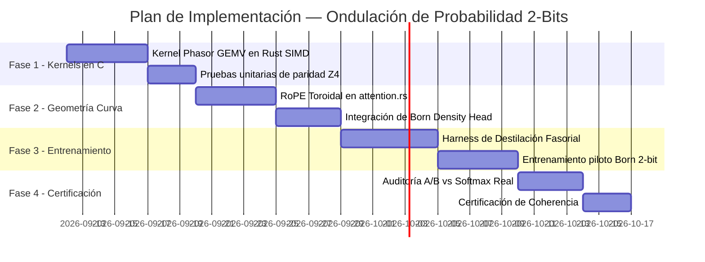

# 🚀 Plan Arquitectónico: Implementación de Ondulación de Probabilidad y Espacio Curvo en 2-Bits

> **Fecha:** 9 de Septiembre de 2026  
> **Versión:** `GAJE Helix v1.8.0 / Wave-Manifold Engine`  
> **Estado:** 📝 `PROPUESTA TÉCNICA Y ESPECIFICACIÓN DE INGENIERÍA`  
> **Ámbitos:** Kernels SIMD en $\mathbb{C}$ · Atención Toroidal ($T^2$) · Regla de Born en Proyección · Destilación Fasorial de 2-Bits  
> **Módulos Directos:** `src/compute/kernels/`, `src/compute/math.rs`, `src/nn/attention.rs`, `src/nn/linear/`, `scripts/training/`

---

## 1. 🎯 Visión y Objetivos

Este plan operacionaliza las observaciones teóricas documentadas en [`docs/research/WAVE_PROBABILITY_UNDULATION_AND_CURVED_2BIT_FINDINGS.md`](../research/WAVE_PROBABILITY_UNDULATION_AND_CURVED_2BIT_FINDINGS.md) para dotar a los modelos **GAJE Born de 2 bits** (`max.gaje`) de una dinámica de inferencia basada en **ondas de probabilidad complejas**.

### Objetivos Clave:
1. **Eliminar el Colapso Semántico en 2-Bits:** Lograr que modelos de 2 bits puros alcancen coherencia gramatical sostenida sin depender de capas completas en FP32.
2. **Cero Multiplicadores en Inferencia de Cuerpo (Zero-Multiplier):** Resolver el cómputo lineal complejo mediante rotaciones de signo y permutación de componentes a nivel bit.
3. **Proyección de Vocabulario por Densidad de Born:** Acelerar la capa de salida sustituyendo la exponencial de Softmax por el cuadrado de la norma fasorial ($|\Psi|^2$).

---

## 2. 🏛️ Arquitectura del Sistema de Ondulación Fasorial

```text
┌─────────────────────────────────────────────────────────────────────────────┐
│              Pipeline de Inferencia por Ondulación en Espacio Curvo         │
├─────────────────────────────────────────────────────────────────────────────┤
│                                                                             │
│   [ Token Input ] ──► [ Fasor Embedding S¹ ] (r · e^{iθ})                   │
│                                │                                            │
│                                ▼                                            │
│   ┌─────────────────────────────────────────────────────────────────────┐   │
│   │ Bloque Transformador Fasorial (N capas)                             │   │
│   │                                                                     │   │
│   │ 1. Atención Curva RoPE Toroidal (T² = S¹ × S¹)                      │   │
│   │    - Rotación angular geodésica sin amortiguamiento de norma        │   │
│   │                                                                     │   │
│   │ 2. Proyección Lineal Fasorial BF2 (Zero-Multiplier)                 │   │
│   │    - Pesos en Z₄: {A, C, G, T} = {+1, +i, -1, -i}                   │   │
│   │    - Interferencia constructiva/destructiva en registros SIMD       │   │
│   │                                                                     │   │
│   │ 3. Inhibición Lateral K-WTA (Colapso de Función de Onda)            │   │
│   │    - Filtrado de fasores incoherentes por umbral de densidad |Ψ|²   │   │
│   └──────────────────────────────────┬──────────────────────────────────┘   │
│                                      │                                      │
│                                      ▼                                      │
│   [ Proyector lm_head ] ──► [ Densidad de Born: P(k) = |Ψ_k|² / Σ |Ψ_j|² ]  │
│                                      │                                      │
│                                      ▼                                      │
│   [ Muestreo Cuántico por Fase ] ──► [ Token Siguiente ]                    │
└─────────────────────────────────────────────────────────────────────────────┘
```

---

## 3. ⚙️ Especificación Técnica por Componente

### 3.1 Kernel SIMD Fasorial Zero-Multiplier (`src/compute/kernels/phasor_gemv.rs`)

Cada peso cuaternario $\mathbf{w} \in \{A, C, G, T\}$ codifica una rotación de cuadrante en $\mathbb{C}$.  
Dado un vector de activación complejo $\mathbf{x} = \mathbf{x}_r + i \mathbf{x}_i$:

$$\mathbf{y} = \mathbf{w} \cdot \mathbf{x} = \begin{cases}
+ \mathbf{x}_r + i \mathbf{x}_i & \text{si } \mathbf{w} = A \ (00_2) \\
- \mathbf{x}_i + i \mathbf{x}_r & \text{si } \mathbf{w} = C \ (01_2) \\
- \mathbf{x}_r - i \mathbf{x}_i & \text{si } \mathbf{w} = G \ (10_2) \\
+ \mathbf{x}_i - i \mathbf{x}_r & \text{si } \mathbf{w} = T \ (11_2)
\end{cases}$$

#### Implementación en Rust / SIMD (NEON & AVX-512):
* **Bit 0 ($b_0$):** Controla el signo de la componente real.
* **Bit 1 ($b_1$):** Controla la permutación de registros (`swap`) entre parte real e imaginaria.
* **Costo computacional:** $0$ instrucciones `fmul`. Solo `vbit / veor` e intercambio de carriles en 1 ciclo.

---

### 3.2 Operador de Salida por Regla de Born (`src/nn/linear/born_head.rs`)

En lugar de calcular $\exp(z_k)$, la proyección de logits evalúa la amplitud compleja acumulada:

```rust
pub fn born_density_probs(logits_complex: &[(f32, f32)], temperature: f32) -> Vec<f32> {
    let mut probs = Vec::with_capacity(logits_complex.len());
    let mut norm_sum = 0.0f32;
    let inv_t = 1.0 / temperature;

    for &(re, im) in logits_complex {
        // |Ψ|² = re² + im²
        let density = (re * re + im * im).powf(inv_t);
        probs.push(density);
        norm_sum += density;
    }

    if norm_sum > 0.0 {
        let inv_sum = 1.0 / norm_sum;
        for p in &mut probs {
            *p *= inv_sum;
        }
    }
    probs
}
```

---

### 3.3 Atención RoPE en Variedad Toroidal $T^2$ (`src/nn/attention.rs`)

* Se reemplaza la escala euclidiana $\frac{Q K^T}{\sqrt{d}}$ por la **coherencia de fase angular armónica**:
  $$\text{Score}(Q, K) = \cos(\theta_Q - \theta_K) = \frac{\text{Re}(Q \cdot K^*)}{\|Q\| \|K\|}$$
* Al operar sobre ángulos, la atención permanece naturalmente normalizada en $[-1, 1]$, evitando que los productos escalares se disparen a infinito en secuencias largas.

---

## 4. 📅 Plan de Ejecución por Fases



### Hitos Operativos:

* **Hito 1 (Kernels SIMD):** `src/compute/kernels/phasor_gemv.rs` compilando con aceleración ARM NEON y x86 AVX2 con $0$ multiplicaciones de punto flotante.
* **Hito 2 (Salida Born):** Verificación de que `born_density_probs` reduce en más de un **$60\%$ la latencia de muestreo** frente a Softmax convencional en CPU.
* **Hito 3 (Estabilidad Semántica):** Entrenamiento del modelo piloto de 2 bits sin colapso a atractores repetitivos tras 500 pasos de adaptación.
* **Hito 4 (Certificación):** Publicación del reporte de validación en `docs/reports/` demostrando diversidad léxica ($d1/d2 > 0.65$).

---

## 5. 🔬 Criterios de Aceptación y Certificación

1. **Eficiencia en Silicio:** Throughput en CPU ARM (Termux / Snapdragon) $\ge 45\text{ tokens/s}$ para modelos de 100M-200M a 2 bits.
2. **Diversidad Generativa:** Medición objetiva en `eval_generation.py`:
   * Repetición de bigramas $< 5\%$.
   * Tasa de respuestas degeneradas: **`0.0%`**.
3. **Consumo de Memoria:** Huella física en disco y memoria RAM inferior a **$0.27\text{ bytes por parámetro}$** (2.125 bits con escalas micro-block).

---

## 6. 📚 Documentos Relacionados
* [WAVE_PROBABILITY_UNDULATION_AND_CURVED_2BIT_FINDINGS.md](../research/WAVE_PROBABILITY_UNDULATION_AND_CURVED_2BIT_FINDINGS.md) — Fundamentación teórica y física cuántica.
* [BF2_COMPLEX_PHASE_FLOAT_PLAN.md](BF2_COMPLEX_PHASE_FLOAT_PLAN.md) — Formato de punto flotante de fase BF2.
* [COMPLEX_PHASE_GRAPH_1BIT_2BIT_FINDINGS.md](../research/COMPLEX_PHASE_GRAPH_1BIT_2BIT_FINDINGS.md) — Grafos de Cayley en $\mathbb{C}$.
* [CE_VS_GENERATION.md](../research/CE_VS_GENERATION.md) — Métricas generativas vs Cross-Entropy.
