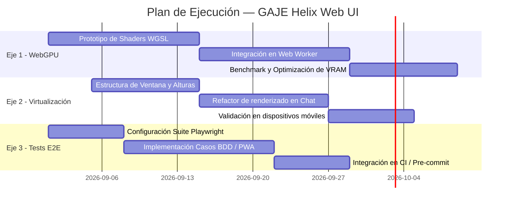

# 🚀 Roadmap de Optimización y Evolución — GAJE Helix Web UI

**Fecha:** 2026-08-25  
**Estado:** Propuesto / Especificación Técnica  
**Módulo:** `examples/ui/web_ui`  
**Ámbitos:** Aceleración WebGPU en Cliente · Virtualización de Renderizado (DOM) · Suite de Pruebas E2E (Playwright)

---

## 1. Visión y Objetivos

La plataforma **GAJE Helix Web UI** (`examples/ui/web_ui`) ha consolidado una arquitectura híbrida pionera:
1. **Modo Zero-Server:** Inferencia de modelos binarios (`.flat`) íntegramente en el navegador vía WebAssembly con SIMD128 y almacenamiento local persistente en IndexedDB (`GajeHelixDB v3`).
2. **Modo Servidor Nativo:** Streaming de ultra-baja latencia (SSE) sobre el motor compilado en Rust con memoria `mmap` zero-copy.

Para llevar esta arquitectura al nivel de producción masiva y soportar modelos de mayor envergadura (`gaje_nano 1.5B`, `gaje_prime 3B`) con sesiones de trabajo prolongadas en dispositivos móviles y de escritorio, se establecen **tres ejes prioritarios de evolución técnica**:

```text
┌─────────────────────────────────────────────────────────────────────────────┐
│                       GAJE Helix Web UI — Ejes de Evolución                │
├─────────────────────────┬─────────────────────────┬─────────────────────────┤
│    1. Aceleración       │   2. Virtualización     │   3. Calidad & E2E      │
│        WebGPU           │      DOM del Chat       │       Playwright        │
├─────────────────────────┼─────────────────────────┼─────────────────────────┤
│ • Pipeline WGSL / WGPU  │ • Virtual Scrolling O(1)│ • Tests PWA & SW        │
│ • Offload GEMM matricial│ • 60 FPS en móviles     │ • Validación IndexedDB  │
│ • Fallback a SIMD128    │ • Overscan & reciclaje  │ • Gates Dual-Theme Y2K  │
└─────────────────────────┴─────────────────────────┴─────────────────────────┘
```

---

## 2. Eje 1 — Aceleración WebGPU para Inferencia In-Browser (WASM + WGSL)

### 2.1 Diagnóstico y Justificación
Actualmente, el modo *Zero-Server* ejecuta la inferencia en un hilo secundario (`wasm_worker.js`) mediante núcleos compilados a WebAssembly con instrucciones SIMD128. Si bien este enfoque es óptimo y universal para modelos ligeros (`gaje_pico_135m` a ~30 tokens/s en CPU ARM), para modelos superiores (`gaje_nano 1.5B` y `gaje_prime 3B`) las multiplicaciones matriz-vector (GEMM), descompresiones K-WTA y activaciones SwiGLU saturan el ancho de banda del hilo CPU en el navegador.

### 2.2 Arquitectura Propuesta

```text
               ┌──────────────────────────────────────────────┐
               │         Browser Runtime (Navigator)          │
               └──────────────────────┬───────────────────────┘
                                      │ Detección de Capacidades
                        ┌─────────────┴─────────────┐
                        ▼                           ▼
            [ navigator.gpu disponible ]    [ Solo CPU / WASM ]
                        │                           │
                        ▼                           ▼
         ┌─────────────────────────────┐   ┌─────────────────┐
         │ Pipeline WebGPU (WGSL)      │   │ WASM SIMD128    │
         │ - GEMM MatMul Shaders       │   │ In-Memory CPU   │
         │ - SwiGLU / RMSNorm Kernels  │   │ Fallback Engine │
         │ - Zero-Copy GPU Buffers     │   └─────────────────┘
         └─────────────────────────────┘
```

### 2.3 Especificación Técnica
1. **Detección y Negociación de Adaptador:**
   * Evaluar soporte mediante `navigator.gpu.requestAdapter({ powerPreference: 'high-performance' })`.
   * En caso de fallo o ausencia de API, degradar de forma transparente al motor WASM SIMD128 actual.
2. **Kernels de Cómputo WGSL:**
   * Implementar shaders de multiplicación matricial `gemm_q4_0.wgsl` y desquantización al vuelo adaptados a la estructura compacta `.flat`.
   * Mantener los pesos de las capas lineales en `GPUBuffer` estáticos y despachar las pasadas de atención y MLP mediante `computePassEncoder`.
3. **Mapeo y Sincronización:**
   * Transferencia asíncrona de logits con `mapAsync(GPUMapMode.READ)` minimizando los bloqueos de sincronización entre el Web Worker y el Pipeline WebGPU.

### 2.4 Entregables y Métricas de Éxito
* **Throughput objetivo:** Duplicar la tasa de generación en `gaje_nano 1.5B` alcanzando $\ge 25\text{ tokens/s}$ en GPUs integradas (Intel Iris / Apple Silicon / Adreno).
* **Consumo de memoria:** Mantener la asignación de buffers GPU por debajo del 120% del tamaño del modelo sin fugas de VRAM tras múltiples conversaciones.

---

## 3. Eje 2 — Virtualización del Historial de Chat (DOM Virtual Scrolling a 60 FPS)

### 3.1 Diagnóstico y Justificación
En sesiones de uso continuas o intensivas, el historial de chat acumula decenas o cientos de mensajes que contienen bloques de código formateados, resaltado de sintaxis, telemetría HUD, árboles de razonamiento (*thought disclosure*) y marcadores de bases genómicas.

Un renderizado DOM tradicional retiene todos los nodos en el árbol del documento, provocando:
* Incremento lineal del consumo de memoria en la pestaña ($O(N)$).
* Degradación de las tasas de refresco de scroll (caídas por debajo de 30 FPS en navegadores móviles).
* Costos crecientes de *reflow* y *layout recalculation* cada vez que se hace streaming de un nuevo token.

### 3.2 Arquitectura de Virtualización (Windowing Engine)

```text
Viewport del Contenedor de Chat
┌─────────────────────────────────────────────────────────┐
│ [Buffer Superior / Overscan] (2 elementos no visibles)  │
├─────────────────────────────────────────────────────────┤ ◄── Inicio Viewport
│ Mensaje Visible #14 (Usuario)                           │
│ Mensaje Visible #15 (GAJE Helix + Thought + Markdown)   │ 60 FPS Scroll
│ Mensaje Visible #16 (Usuario)                           │
├─────────────────────────────────────────────────────────┤ ◄── Fin Viewport
│ [Buffer Inferior / Overscan] (2 elementos no visibles)  │
└─────────────────────────────────────────────────────────┘
  Espacio simulado con 'padding-top' / 'padding-bottom' dinámico
```

### 3.3 Especificación Técnica
1. **Dimensionamiento Dinámico y Caché de Alturas:**
   * Crear un registro de alturas indexado por `message_id` en el gestor de estado (`static/js/chat/state.js`).
   * Actualizar dinámicamente la altura estimada mediante `ResizeObserver` para acomodar mensajes con código colapsable o streaming en curso.
2. **Ventana de Renderizado (Windowing):**
   * Modularizar `static/js/chat/engine.js` para mantener en el DOM únicamente los nodos visibles correspondientes a:
     $$\text{Índice Inicio} = \max(0, \text{ScrollTop} / \bar{H} - \text{Overscan})$$
     $$\text{Índice Fin} = \min(N, (\text{ScrollTop} + H_{\text{viewport}}) / \bar{H} + \text{Overscan})$$
   * Ajustar los contenedores espaciadores superior e inferior para preservar la barra de desplazamiento nativa sin saltos (*scroll jumping*).
3. **Compatibilidad con Streaming:**
   * Anclar automáticamente el scroll hacia abajo (*stick-to-bottom*) cuando el usuario esté leyendo el último mensaje en generación activa.

### 3.4 Entregables y Métricas de Éxito
* **Consumo de memoria DOM:** Constante $O(1)$ ($\le 25$ nodos de mensajes activos en el DOM simultáneamente).
* **Fluidez:** Mantener 60 FPS estables durante el desplazamiento en listas de más de 500 mensajes en navegadores móviles y de escritorio.

---

## 4. Eje 3 — Suite de Pruebas Automatizadas E2E (Playwright)

### 4.1 Diagnóstico y Justificación
La naturaleza dual de la aplicación (PWA + Service Worker + IndexedDB + Streaming SSE + Dual-Theme) requiere validaciones automatizadas de extremo a extremo que garanticen la integridad de los flujos de usuario antes de cada despliegue o cambio de versión.

### 4.2 Matriz de Pruebas E2E Requeridas

| Módulo / Funcionalidad | Escenario de Prueba (BDD) | Criterio de Aceptación / Aserción |
|---|---|---|
| **PWA & Service Worker** | Registro de `sw.js`, modo standalone y auto-actualización. | `navigator.serviceWorker.controller` activo; botón `[🔄 Actualizar]` visible ante nuevo cache hash. |
| **Almacenamiento IndexedDB** | Apertura de `GajeHelixDB v3`, escritura de mensajes y Model Cache. | Integridad de almacenes `messages`, `memory_islands` y `model_cache` tras recarga sin red. |
| **Sistema Dual-Theme Y2K** | Alternancia entre `y2k-dark` y `y2k-light`. | `document.documentElement.dataset.theme` cambia; persistencia en `localStorage`; radio 0px en modo light. |
| **Streaming de Chat & HUD** | Flujo de inferencia nativa (SSE) y motor WASM. | Recepción progresiva de tokens, actualización de latencia en HUD, finalización con stop token. |
| **Navegación e Integración** | Cambio entre pestañas Chat, Arquitectura y Documentación. | Carga correcta de SVG interactivo y renderizado de especificaciones sin errores de consola. |

### 4.3 Implementación de la Suite (`tests/e2e/web_ui_e2e.spec.js`)

```javascript
import { test, expect } from '@playwright/test';

test.describe('GAJE Helix Web UI — Suite de Validación E2E', () => {
  test.beforeEach(async ({ page }) => {
    await page.goto('http://localhost:8000');
  });

  test('1. Debe inicializar GajeHelixDB v3 y registrar Service Worker', async ({ page }) => {
    const swRegistered = await page.evaluate(async () => {
      const reg = await navigator.serviceWorker.getRegistration();
      return !!reg;
    });
    expect(swRegistered).toBe(true);

    const dbReady = await page.evaluate(async () => {
      return !!window.gajeStorage && !!window.gajeStorage.db;
    });
    expect(dbReady).toBe(true);
  });

  test('2. Debe alternar y persistir el tema Dual-Theme Y2K', async ({ page }) => {
    const themeBtn = page.locator('#theme-toggle-btn');
    await themeBtn.click();
    
    const theme = await page.evaluate(() => document.documentElement.dataset.theme);
    expect(['dark', 'light']).toContain(theme);

    // Verificar persistencia tras recarga
    await page.reload();
    const persistedTheme = await page.evaluate(() => localStorage.getItem('gaje_theme'));
    expect(persistedTheme).toBe(theme);
  });

  test('3. Debe renderizar y conectar la vista de Arquitectura interactiva', async ({ page }) => {
    await page.click('a[href="#architecture"]');
    const svgElement = page.locator('#arch-view svg');
    await expect(svgElement).toBeVisible();
    
    const nodeCount = await page.locator('#arch-view .graph-node').count();
    expect(nodeCount).toBeGreaterThan(10);
  });
});
```

---

## 5. Plan de Ejecución por Hitos



---

## 6. Documentos Relacionados
* [WEB_UI_IMPROVEMENT_PLAN.md](file:///data/data/com.termux/files/home/develop/gaje-semantic-compression/docs/plans/WEB_UI_IMPROVEMENT_PLAN.md) — Plan base de arquitectura y streaming.
* [WASM_BRAINSTEM_PLAN.md](file:///data/data/com.termux/files/home/develop/gaje-semantic-compression/docs/plans/WASM_BRAINSTEM_PLAN.md) — Especificación del tronco encefálico WASM.
* [GPU_ACCELERATION_BACKEND_PLAN.md](file:///data/data/com.termux/files/home/develop/gaje-semantic-compression/docs/plans/GPU_ACCELERATION_BACKEND_PLAN.md) — Backend nativo Vulkan / WGPU.
