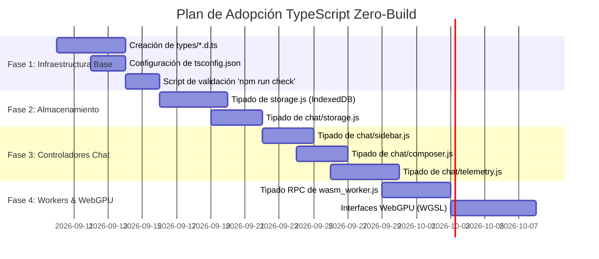

# 🛡️ Plan de Integración TypeScript Zero-Build — GAJE Helix Web UI

**Fecha:** 2026-09-09  
**Estado:** Propuesto / Especificación Técnica  
**Módulo:** `examples/ui/web_ui`  
**Estrategia:** Tipado Estático Soberano (JSDoc + `checkJs` + Definiciones `.d.ts`)  
**Ámbitos:** Seguridad de Tipos · Cero Paso de Build · Cero Impacto en Runtime · Validación Estricta

---

## 1. Visión y Objetivos

La interfaz de usuario **GAJE Helix Web UI** (`examples/ui/web_ui`) ha evolucionado hacia una arquitectura modular con múltiples subsistemas críticos:
1. **Base de Datos Soberana en Cliente:** IndexedDB (`GajeHelixDB v3`) para persistencia de mensajes, sesiones aisladas, islas de memoria genómica (`.gmem`) y caché de modelos.
2. **Motor de Inferencia Dual:** Streaming SSE sobre servidor nativo Rust/Python y modo *Zero-Server* vía WebAssembly Worker (`wasm_worker.js`).
3. **Telemetría HUD en Tiempo Real:** Métricas de rendimiento (`tps`, `ppl`, `bpc`, decodificación, hardware profiling).
4. **Gestor de Conversaciones Avanzado:** Historial con búsqueda en vivo, agrupación cronológica y exportación a Markdown/JSON.

A medida que el código crece y se prepara para la **Aceleración WebGPU (WGSL)** según el [Roadmap de Optimización](WEB_UI_OPTIMIZATION_ROADMAP.md), surge la necesidad de contar con **seguridad de tipos y autocompletado riguroso**.

### Principio Rector: Soberanía y Cero Paso de Compilación
Para mantener la fidelidad a los principios del proyecto (ejecución ligera en entornos móviles/Termux, servidor HTTP nativo sin dependencias de Node.js en producción y despliegue estático instantáneo), se adopta la **Opción 1: TypeScript Zero-Build**:

```text
┌─────────────────────────────────────────────────────────────────────────────┐
│                 Arquitectura de Tipado TypeScript Zero-Build                │
├─────────────────────────────────────────┬───────────────────────────────────┤
│           En Tiempo de Diseño / CI      │         En Tiempo de Ejecución    │
│           (Type-Checking Estático)      │          (Navegador / Producción) │
├─────────────────────────────────────────┼───────────────────────────────────┤
│ • Catálogo de interfaces (types/*.d.ts) │ • JavaScript ES6+ Vanilla Puro    │
│ • tsconfig.json con "checkJs": true     │ • Cero transpiler en runtime      │
│ • Linter 'tsc --noEmit' en CI/precommit │ • Cero lag de build en recargas   │
│ • Autocompletado inteligente en editor  │ • Servidor nativo Python/Rust OK  │
└─────────────────────────────────────────┴───────────────────────────────────┘
```

---

## 2. Arquitectura del Catálogo de Tipos (`types/`)

Se creará una carpeta dedicada `examples/ui/web_ui/types/` que alojará exclusivamente archivos de definición de tipos `.d.ts` (sin código ejecutable en runtime):

```text
examples/ui/web_ui/
├── tsconfig.json                       # Configuración estricta de validación
├── types/
│   ├── gaje_chat.d.ts                  # Mensajes, roles, sesiones y eventos de chat
│   ├── gaje_db.d.ts                    # Esquemas de GajeHelixDB e IndexedDB
│   ├── gaje_telemetry.d.ts             # Métricas HUD, profiling y épocas de memoria
│   ├── gaje_worker.d.ts                # Protocolo de mensajería RPC del WASM Worker
│   ├── gaje_webgpu.d.ts                # Interfaces de buffers y shaders WGSL
│   └── gaje_globals.d.ts               # Declaraciones de window.GajeChat, window.GajeDB, etc.
└── static/js/                          # Código JS enriquecido con anotaciones JSDoc
```

---

## 3. Especificación de los Esquemas de Tipos

### 3.1 Esquema de Chat y Sesiones (`types/gaje_chat.d.ts`)

```typescript
export type ChatRole = 'user' | 'assistant' | 'system';

export interface ChatMetrics {
    tps?: number;
    tokens_generated?: number;
    decode_time?: number;
    server_time?: string;
    timestamp_posix?: number;
    ratio?: number;
    bpc?: number;
    ppl?: number;
}

export interface ChatMessage {
    id?: number;
    role: ChatRole;
    content: string;
    thought?: string | null;
    model?: string;
    meta?: ChatMetrics | null;
    time?: string;
    timestampPosix?: number;
    sessionId: string;
    savedAt?: number;
}

export interface ChatSession {
    sessionId: string;
    title: string;
    customTitle?: boolean;
    model?: string;
    createdAt: number;
    lastActivity: number;
}
```

### 3.2 Esquema de Base de Datos Soberana (`types/gaje_db.d.ts`)

```typescript
import { ChatMessage, ChatSession } from './gaje_chat';

export interface MemoryIslandRecord {
    key: string;
    organism: string;
    niche: 'episodic' | 'document' | 'chat';
    vector?: number[];
    text: string;
    updatedAt: number;
}

export interface AuditLogRecord {
    id?: number;
    text: string;
    level: 'info' | 'warn' | 'error';
    timestamp: number;
    time: string;
}

export interface DatabaseExportPayload {
    exportedAt: string;
    totalSessions: number;
    totalMessages: number;
    sessions: ChatSession[];
    messages: ChatMessage[];
    auditLogs?: AuditLogRecord[];
}
```

### 3.3 Esquema de Comunicación con Worker WASM (`types/gaje_worker.d.ts`)

```typescript
export type WasmInboundAction = 
    | { type: 'INIT'; payload: { simdSupported: boolean } }
    | { type: 'LOAD_MODEL'; payload: { modelUrl: string; modelName: string } }
    | { type: 'GENERATE'; payload: { prompt: string; maxTokens: number; temperature: number } }
    | { type: 'STOP' };

export type WasmOutboundEvent = 
    | { type: 'READY'; version: string }
    | { type: 'PROGRESS'; loaded: number; total: number }
    | { type: 'TOKEN'; token: string; tokenId: number; tps: number }
    | { type: 'COMPLETE'; totalTokens: number; elapsedSeconds: number }
    | { type: 'ERROR'; error: string };
```

---

## 4. Configuración del Verificador (`tsconfig.json`)

Se establecerá un archivo de configuración en la raíz de `examples/ui/web_ui/` configurado para analizar el código JS con las reglas más estrictas de TypeScript sin generar archivos intermedios:

```json
{
  "compilerOptions": {
    "target": "ES2022",
    "module": "ESNext",
    "moduleResolution": "Node",
    "lib": ["ES2022", "DOM", "DOM.Iterable", "WebWorker"],
    "allowJs": true,
    "checkJs": true,
    "noEmit": true,
    "strict": true,
    "noImplicitAny": true,
    "strictNullChecks": true,
    "strictFunctionTypes": true,
    "noUnusedLocals": true,
    "noUnusedParameters": true,
    "skipLibCheck": true,
    "baseUrl": ".",
    "paths": {
      "@types/*": ["types/*"]
    }
  },
  "include": [
    "static/js/**/*.js",
    "types/**/*.d.ts"
  ],
  "exclude": [
    "node_modules",
    "dist"
  ]
}
```

---

## 5. Patrón de Implementación con JSDoc

Los archivos JavaScript existentes se anotan progresivamente usando comentarios estándar JSDoc. No se altera la sintaxis de JavaScript en absoluto:

### Ejemplo: Anotación en `static/js/storage.js`
```javascript
/**
 * Guarda o actualiza los metadatos de una sesión en el store 'sessions'.
 * @param {import('../types/gaje_chat').ChatSession} sessionData
 * @returns {Promise<import('../types/gaje_chat').ChatSession | null>}
 */
async saveSession(sessionData) {
    // Implementación JavaScript idéntica a la actual
}
```

### Ejemplo: Anotación de Controladores Globales
```javascript
/** @type {import('../types/gaje_chat').ChatSession[]} */
const sessionList = await GajeDB.getAllSessions();
```

---

## 6. Plan de Ejecución por Fases



### Desglose de Fases:

1. **Fase 1 — Infraestructura y Contratos Centrales:**
   * Crear los archivos de tipos en `examples/ui/web_ui/types/`.
   * Configurar `tsconfig.json` con `"checkJs": true`.
   * Probar la primera verificación estática ejecutando `npx tsc --noEmit`.

2. **Fase 2 — Núcleo de Persistencia y Base de Datos:**
   * Anotar [`static/js/storage.js`](file:///data/data/com.termux/files/home/develop/gaje-semantic-compression/examples/ui/web_ui/static/js/storage.js) y [`static/js/chat/storage.js`](file:///data/data/com.termux/files/home/develop/gaje-semantic-compression/examples/ui/web_ui/static/js/chat/storage.js).
   * Validar que todas las operaciones CRUD sobre IndexedDB retornen tipos estrictos.

3. **Fase 3 — Controladores de UI y Telemetría:**
   * Anotar [`static/js/chat/sidebar.js`](file:///data/data/com.termux/files/home/develop/gaje-semantic-compression/examples/ui/web_ui/static/js/chat/sidebar.js), [`static/js/chat/composer.js`](file:///data/data/com.termux/files/home/develop/gaje-semantic-compression/examples/ui/web_ui/static/js/chat/composer.js) y [`static/js/chat/telemetry.js`](file:///data/data/com.termux/files/home/develop/gaje-semantic-compression/examples/ui/web_ui/static/js/chat/telemetry.js).
   * Asegurar autocompletado completo de eventos de usuario y actualización de DOM.

4. **Fase 4 — Inferencia Local, Workers y Preparación WebGPU:**
   * Anotar el worker WebAssembly y la comunicación postMessage.
   * Dejar preparadas las definiciones para shaders y buffers WGSL del Roadmap de WebGPU.

---

## 7. Verificación e Integración en CI

Para verificar la integridad de tipos en cualquier momento sin alterar el entorno:

```bash
# Verificación de tipos sin emisión de archivos
npx tsc -p examples/ui/web_ui/tsconfig.json --noEmit
```

* **Criterio de Aceptación:** `0 errores de tipo` reportados por el compilador TypeScript.
* **Cero Impacto:** El servidor `python server.py` o `gaje-cli serve` continúa funcionando exactamente igual, sirviendo archivos `.js` limpios directamente al navegador.

---

## 8. Documentos Relacionados
* [WEB_UI_OPTIMIZATION_ROADMAP.md](WEB_UI_OPTIMIZATION_ROADMAP.md) — Hoja de ruta WebGPU y virtualización DOM.
* [EMPIRICAL_TRUTH_STATE.md](../meta/EMPIRICAL_TRUTH_STATE.md) — Matriz de estado técnico del sistema.
