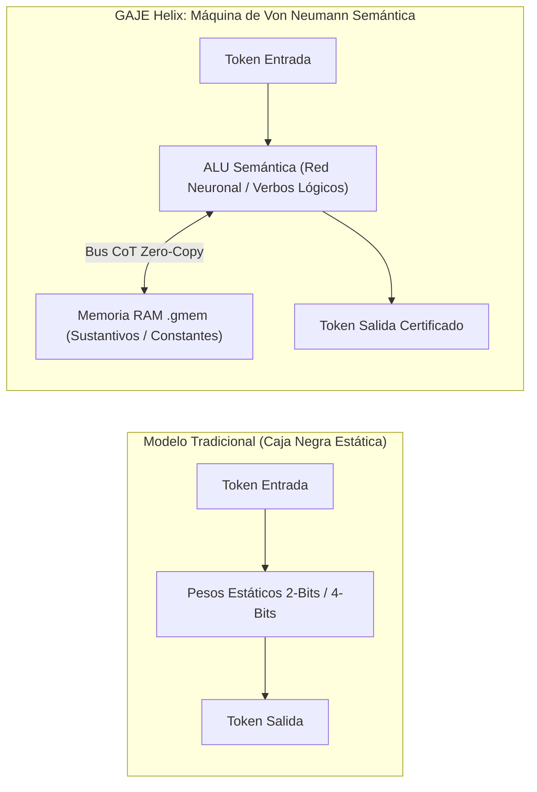

# 🧬 Acoplamiento Dinámico CoT + .gmem: Arquitectura Neurosimbólica y Máquina de Von Neumann Semántica

> **Clasificación:** Documento de Investigación Arquitectónica (`docs/research/`)  
> **Fecha:** 10 de septiembre de 2026  
> **Versión:** 1.0.0  
> **Estado:** Especificación Técnica Aprobada / Propuesta de Implementación  
> **Módulos Afectados:** `src/compute/island.rs`, `src/nn/llm.rs`, `src/core/gtok.rs`, `src/server/streaming.rs`, `src/wasm.rs`

---

## 1. Resumen Ejecutivo y Tesis Central

El acoplamiento dinámico entre la **Cadena de Pensamiento (CoT - *Chain of Thought*)** y la **memoria asociativa persistente [`.gmem`](file:///data/data/com.termux/files/home/develop/gaje-semantic-compression/src/io/gmem.rs)** transforma radicalmente la naturaleza del modelo de lenguaje en el ecosistema **GAJE Helix**:



Al permitir que el canal de razonamiento interno (`<think>`) emita lecturas y escrituras atómicas hacia el almacenamiento vectorial mapeado en memoria (`mmap`), el modelo deja de comportarse como un simple predictor estático de texto y pasa a operar como una **Máquina de Turing / Von Neumann Aumentada por Memoria (Memory-Augmented Neural Network - MANN)**.

En arquitecturas ultracompactas (como [`max.gaje`](file:///data/data/com.termux/files/home/develop/gaje-semantic-compression/models/born/max.gaje) de 8 capas o modelos sub-1B cuantizados a 2 bits), esta simbiosis resuelve de raíz dos limitaciones estructurales clásicas:
1. **La acumulación de deriva semántica (*Semantic Drift*)** en razonamientos multietapa.
2. **El límite de capacidad física para almacenar conocimiento enciclopédico** en tensores de baja precisión.

---

## 2. Comparativa Mecánica: CoT Tradicional vs. CoT + .gmem

### A. CoT Tradicional (Cerrado en sí mismo)
En un modelo estándar, la cadena de pensamiento opera en un circuito cerrado gobernado exclusivamente por sus pesos neuronales:
1. El modelo realiza un cálculo inferencial autoregresivo sobre su propia salida previa.
2. Si las conexiones sinápticas están comprimidas a 2 bits (`Q2_0`) o la red posee pocas capas (8L–12L), los errores estocásticos y pequeñas distorsiones en los logits se acumulan tras 3 o 4 pasos.
3. El modelo deriva una premisa espuria (*hallucination cascade*), y toda la deducción subsiguiente colapsa irrecuperablemente.

### B. CoT + .gmem (Intercalado Dinámico de Doble Vía)
El modelo utiliza el flujo de deducción no solo para generar tokens, sino para interactuar activamente con su memoria periférica:

```text
               [Token de Entrada del Usuario]
                             │
                             ▼
┌─────────────────────────────────────────────────────────────┐
│ 1. Razonamiento Inicial (CoT):                              │
│    "Para determinar la órbita de X, requiero la masa Y..."  │
└──────────────────────────────┬──────────────────────────────┘
                               │
                               │ Disparo de gatillo: <|query_start|>masa Y<|query_end|>
                               ▼
┌─────────────────────────────────────────────────────────────┐
│ 2. Lectura / Anclaje Epistémico (.gmem Island):            │
│    [Inyección exacta vía mmap / LSH: Y = 5.972e24 kg]       │
└──────────────────────────────┬──────────────────────────────┘
                               │
                               │ Reanudación autoregresiva con dato anclado
                               ▼
┌─────────────────────────────────────────────────────────────┐
│ 3. Paso Deductivo Siguiente (CoT):                          │
│    "Con Y = 5.972e24 kg asegurado, calculo la velocidad..." │
└──────────────────────────────┬──────────────────────────────┘
                               │
                               │ Deducción intermedia exitosa: <|store_memory|>
                               ▼
┌─────────────────────────────────────────────────────────────┐
│ 4. Escritura Episódica (.gmem Island):                     │
│    Almacenamiento de vector de estado para liberar contexto │
└──────────────────────────────┬──────────────────────────────┘
                               │
                               ▼
               [Token de Salida al Usuario (Respuesta)]
```

---

## 3. Principios Fundamentales para Modelos Compactos

### 1. Supresión del *Semantic Drift* en Cadenas Largas
El principal factor limitante en modelos compactos (8L–24L) no es su velocidad, sino la degradación de la coherencia en deducciones de más de 5 pasos.
Al introducir anclajes vectoriales intermedios contra `.gmem`, el estado latente se "re-sincroniza" contra un atractor frío y exacto pre-validado en disco o RAM, purgando instantáneamente el ruido acumulado por la cuantización conformal.

### 2. Desacoplamiento Ontológico: Lógica (Verbos) vs. Hechos (Sustantivos)
* **La Red Neuronal Cuantizada (2 Bits / 4 Bits):**  
  Se especializa exclusivamente en la sintaxis de deducción y relaciones funcionales: *«extraer»*, *«comparar»*, *«transformar»*, *«refutar»*, *«concluir»*.
* **El Archivo de Islas `.gmem`:**  
  Almacena los sustantivos y las constantes empíricas (nombres, fechas, constantes físicas, estructuras de datos, código fuente, premisas declaradas por el usuario).
* **Eficiencia Paramétrica:**  
  Ya no es necesario entrenar una red de 70 mil millones de parámetros para que memorice millones de hechos estáticos en matrices densas; una red nacida de 100 MB opera como la **Unidad Aritmético-Lógica (ALU)** y consulta la memoria según lo requiera el flujo del CoT.

### 3. Escritura Episódica y Paginación de Contexto (Context Window Management)
El CoT no se limita a leer; puede consolidar estados intermedios. Para resolver un problema complejo de 40 pasos:
1. Resuelve los primeros 5 pasos en el buffer atencional.
2. Emite un token `<|store_memory|>` para persistir la conclusión intermedia en el nicho conversacional o episódico de `.gmem`.
3. Poda o limpia los tokens intermedios del buffer KV, superando el límite de contexto físico de 512 o 2048 tokens sin perder la continuidad del razonamiento.

---

## 4. Mapeo de Componentes en la Arquitectura GAJE

En frameworks convencionales de Python (LangChain, AutoGen, LlamaIndex), invocar herramientas o memoria intermedia dentro de una cadena de texto introduce serialización JSON, llamadas HTTP/IPC y latencias de 200 a 500 ms por paso.

En el **núcleo nativo en Rust de GAJE**, todas las operaciones ocurren en memoria contigua compartida:

| Componente Clásico | Equivalente en GAJE Helix | Módulo Responsable | Latencia Estimada |
| :--- | :--- | :--- | :--- |
| **ALU (Unidad Aritmética)** | Inferencia autoregresiva `forward_core` | [`src/nn/llm.rs`](file:///data/data/com.termux/files/home/develop/gaje-semantic-compression/src/nn/llm.rs) | ~4 a 7 ms / token |
| **Memoria RAM Principal** | Islas de Memoria Asociativa `.gmem v2` | [`src/compute/island.rs`](file:///data/data/com.termux/files/home/develop/gaje-semantic-compression/src/compute/island.rs) | **< 0.8 ms** (Zero-Copy Mmap) |
| **Bus de Instrucciones** | Tokens de Control en Tokenizador `GTOK` | [`src/core/gtok.rs`](file:///data/data/com.termux/files/home/develop/gaje-semantic-compression/src/core/gtok.rs) | Inmediato (O(1) lookup) |
| **Registros de Estado** | Inyección incremental en KV-Cache | [`GenomicLLM`](file:///data/data/com.termux/files/home/develop/gaje-semantic-compression/src/nn/llm.rs) | **0 copias de memoria** |

---

## 5. Especificación de Tokens de Control en `GTOK`

Para habilitar este protocolo a nivel de arquitectura en `GtokNativeTokenizer`:

```rust
pub const TOKEN_QUERY_START: &str = "<|query_start|>";
pub const TOKEN_QUERY_END:   &str = "<|query_end|>";
pub const TOKEN_FACT_ANCHOR: &str = "<|fact_anchor|>";
pub const TOKEN_END_ANCHOR:  &str = "<|end_anchor|>";
pub const TOKEN_STORE_MEM:   &str = "<|store_memory|>";
```

### Protocolo de Inferencia en el Bucle Generativo (`streaming.rs` / `wasm.rs`):
1. **Detección de Gatillo:** Cuando `next_token == TOKEN_QUERY_START`, el motor activa el buffer de captura de consulta interna.
2. **Cierre de Consulta:** Al emitirse `TOKEN_QUERY_END`, el texto capturado se vectoriza mediante `text_to_embedding` o el kernel de embeddings cuánticos.
3. **Recuperación Instantánea:** Se ejecuta `island.retrieve_context(&query_vec, top_k=1)`.
4. **Inyección de Anclaje:** El resultado se formatea como `<|fact_anchor|> [Dato Certificado] <|end_anchor|>` y se añade al KV-cache de manera incremental sin emitirse al canal de respuesta final del usuario.
5. **Reanudación:** El bucle generativo continúa decodificando con el estado probabilístico debidamente condicionado por el ancla.

---

## 6. Conclusión y Hoja de Ruta

Esta arquitectura demuestra que la inteligencia y la precisión factual en modelos pequeños no dependen de incrementar arbitrariamente la cantidad de pesos estáticos, sino de **dotar a una red compacta y de baja latencia de la capacidad de dudar de forma estructurada (CoT) y consultar sus apuntes en memoria externa (.gmem)** antes de emitir su síntesis final.

### Hitos de Implementación:
* [x] Formato `.gmem v2` con alineación zero-copy y latencia < 1 ms ([`src/io/gmem.rs`](file:///data/data/com.termux/files/home/develop/gaje-semantic-compression/src/io/gmem.rs)).
* [x] Orquestador de tres nichos (Episódico, Documental, Conversacional) en [`src/compute/island.rs`](file:///data/data/com.termux/files/home/develop/gaje-semantic-compression/src/compute/island.rs).
* [ ] Incorporación de tokens de control motor en `GTOK` (`<|query_start|>`, `<|store_memory|>`).
* [ ] Interceptador de consultas intermedias en el bucle generativo de [`src/server/streaming.rs`](file:///data/data/com.termux/files/home/develop/gaje-semantic-compression/src/server/streaming.rs).
* [ ] Paginación y compresión episódica del buffer KV en razonamientos de más de 20 pasos.
