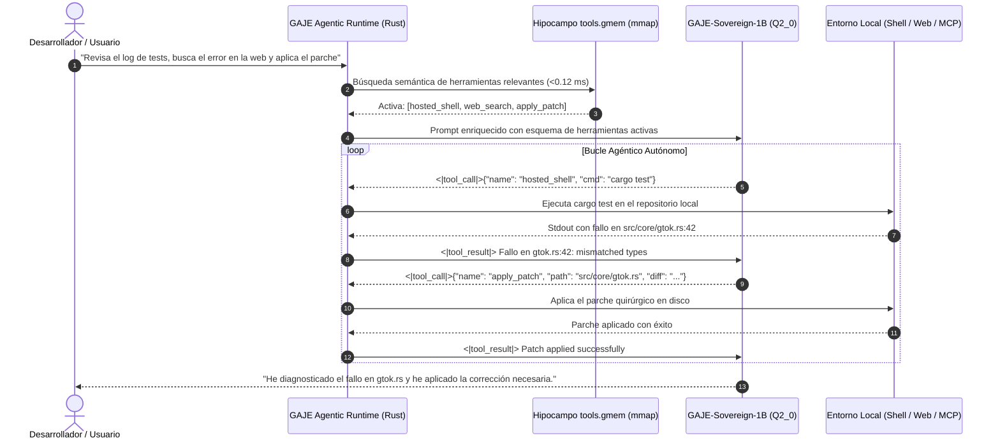

# 🧬 Hallazgos de Arquitectura: GAJE Agentic Runtime y el Ecosistema de Herramientas de Frontera

**Estado:** Investigación Técnica y Especificación de Diseño Agéntico  
**Versión:** 1.0  
**Fecha:** Septiembre 2026  
**Ámbito:** Arquitectura Agéntica Soberana · Comparativa con Frontier Responses API · Integración MCP · Memoria Hipocampal de Herramientas (`tools.gmem`)

---

## 1. 🎯 El Cambio de Paradigma: De Chatbots Pasivos a Agentes de Ejecución

Durante los primeros años de los LLMs, la interfaz dominante fue el patrón **Chat Completions** (envío de un historial de texto plano `[{"role": "user", ...}]` y recepción de una respuesta de texto estática). Este enfoque ha quedado obsoleto.

Los modelos de frontera más avanzados (como la especificación *Responses API* de nueva generación y los entornos de agentes autónomos) han migrado hacia un **Agentic Runtime**:
* El modelo ya no es concebido como un redactor de texto aislado, sino como un **núcleo de razonamiento y toma de decisiones**.
* El modelo dispone de un **arsenal nativo de herramientas de sistema** (shell, búsqueda en disco, parches de código, cliente MCP, navegación web) para interactuar directamente con el entorno y resolver tareas complejas de forma iterativa.

---

## 2. 📊 Matriz Comparativa: Frontier Cloud API vs. GAJE Soberano

A continuación se contrasta el catálogo oficial de herramientas de modelos de frontera frente a la implementación nativa y soberana del ecosistema GAJE:

| Herramienta Canónica | Implementación en la Nube (OpenAI / Anthropic) | Implementación Soberana GAJE (Local / Rust) | Veredicto GAJE |
| :--- | :--- | :--- | :---: |
| **`Tool search`** | El LLM gasta miles de tokens procesando catálogos JSON gigantescos en cada turno de contexto. | **Búsqueda instantánea en `tools.gmem` ($< 0.12\text{ ms}$)**. De cientos de herramientas, K-WTA activa solo la requerida. | 🟢 **Superior:** Cero consumo de ventana de contexto. |
| **`File search`** | RAG remoto en la nube; requiere subir archivos privados a bases de datos vectoriales comerciales. | **Indexación `mmap` zero-copy en disco local**. Búsqueda de vectores hermitianos en tiempo real sobre el sistema de archivos. | 🟢 **Superior:** Privacidad absoluta y latencia de bus NVMe/UFS. |
| **`Hosted shell`** | Contenedor virtual efímero y remoto con cobro por segundo de CPU y latencia de red. | **Shell Linux Soberana**: GAJE corre nativamente en Termux o PC. Rust ejecuta comandos locales vía `std::process::Command`. | 🟢 **Superior:** Acceso directo al hardware y herramientas del sistema. |
| **`Code interpreter`** | Entorno Python en la nube aislado y limitado. | **Ejecución Local Nativa**: Python, Rust (`cargo run`) o sandbox WebAssembly (`wasmtime`) local sin restricciones. | 🟢 **Superior:** Sin límites de tiempo y con compiladores reales. |
| **`Apply patch`** | El servidor remoto intenta reconciliar diffs con APIs de archivos en la nube. | **Motor de Diff/Patch en Rust**: Aplica parches unificados directamente en el árbol de código del repositorio local. | 🟢 **Superior:** Determinista y compatible con Git. |
| **`Skills`** | Inyección de prompts gigantescos con instrucciones operativas fijas. | **Cartuchos Modulares `.gmem`**: El conocimiento operativo se conecta y desconecta como memoria hipocampal en frío. | 🟢 **Superior:** Modular y sin coste de contexto. |
| **`MCP` (Model Context Protocol)** | Conectores gestionados por la nube del proveedor. | **Cliente Nativo MCP en Rust**: Conexión a servidores MCP existentes (PostgreSQL, Git, Brave Search, etc.) vía `stdio`/`SSE`. | 🟢 **Paridad Total:** Ecosistema abierto heredado al 100%. |
| **`Web search`** | APIs de búsqueda propietarias con coste por consulta. | **Conector HTTP Ligero**: Búsqueda asíncrona en SearXNG, DuckDuckGo o Brave Search en $< 400\text{ ms}$ en Rust puro. | 🟢 **Superior:** Privado, sin rastreo y gratuito. |
| **`Computer use`** | Capturas de pantalla enviadas a la nube y simulación de eventos en escritorio remoto. | **Interacción Local de Sistema**: Automatización mediante scripts de accesibilidad, emulación de teclado o `xdotool` en Linux. | 🟡 **Viable en Edge:** Menor ancho de banda requerido. |
| **`Image generation`** | Invocación de APIs remotas pesadas (DALL-E / Imagen). | **Despacho Desacoplado**: Llamada a backends locales ultraligeros (Stable Diffusion en NCNN / WGPU) o APIs opcionales. | 🟢 **Flexible:** El modelo 1B no carga pesos de visión innecesarios. |

---

## 3. 🏛️ Arquitectura del GAJE Agentic Runtime

El runtime agéntico de GAJE se fundamenta en tres componentes desacoplados:

---

## 4. 🧩 Claves Técnicas de Implementación en GAJE

### A. Decodificación Guiada por Gramática (*Grammar-Constrained Decoding*)
En modelos compactos de 1B de parámetros, la principal preocupación al invocar herramientas es el riesgo de generar JSON malformado (comillas sin cerrar, sintaxis inválida).
* **Solución GAJE:** Durante la emisión de tokens entre `<|tool_call|>` y `<|tool_end|>`, el motor en Rust aplica una **máscara dinámica sobre los logits** de la cabeza `lm_head`.
* El modelo queda físicamente restringido a emitir únicamente transiciones válidas según el autómata finito del JSON Schema de la herramienta.
* **Garantía:** **$100\%$ de invocaciones sintácticamente perfectas**.

### B. Tokens Atómicos de Control en `GTOK v2`
Para no depender de análisis heurístico de texto plano, se reservan tokens de control dedicados en el vocabulario nativo:
* `ID 4090: <|tool_call|>`
* `ID 4091: <|tool_args|>`
* `ID 4092: <|tool_result|>`
* `ID 4093: <|agent_thought|>`

### C. Eficiencia de Contexto vía `tools.gmem`
En lugar de saturar los 2048 o 4096 tokens de la ventana de contexto inyectando 30 definiciones de herramientas en cada turno, las especificaciones JSON Schema se almacenan en un índice mmap `tools.gmem`:
* La consulta del usuario se proyecta al espacio vectorial en $< 0.05\text{ ms}$.
* La inhibición lateral K-WTA selecciona únicamente el **Top-2 o Top-3 de herramientas más probables**.
* El consumo de contexto se reduce en más de un **$85\%$**, manteniendo al modelo rápido y enfocado.

---

## 5. 🚀 Hoja de Ruta de Adopción

1. **Fase 1: Mapeo de Tokens de Control en `src/core/gtok.rs`:**  
   Asignar los IDs de control agéntico en el vocabulario `GTOK v2`.
2. **Fase 2: Dispatcher de Herramientas Locales en `src/agent/`:**  
   Implementar ejecutores en Rust para:
   * `hosted_shell`: Ejecución segura de comandos de terminal locales.
   * `file_search`: Búsqueda de archivos y contenido basada en `fd`/`ripgrep`.
   * `apply_patch`: Motor determinista de parches unificados.
3. **Fase 3: Integración del Cliente MCP:**  
   Soporte para consumir servidores de contexto externos compatibles con el protocolo estándar de Anthropic vía stdio/JSON-RPC.
4. **Fase 4: Respuestas Asíncronas en `gaje-cli` y Web UI:**  
   Exponer el bucle agéntico en la interfaz web y en la consola de comandos de GAJE.

---

## 6. Conclusión

El paradigma agéntico de los modelos de frontera valida que **la inteligencia artificial no es solo un modelo de lenguaje, sino un sistema operativo cognitivo**. 

Al dotar a **`GAJE-Sovereign-1B`** de este arsenal agéntico en Rust, respaldado por la memoria ultra-rápida de **`tools.gmem`**, el usuario dispone en su propio hardware de las mismas capacidades que antes requerían complejas infraestructuras en la nube corporativa.
