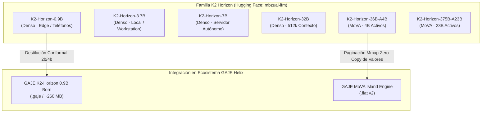

# 🧬 K2 Horizon (MBZUAI-IFM): Análisis de Arquitectura MoVA y Viabilidad para Destilación Genómica en GAJE

> **Clasificación:** Documento de Investigación y Evaluación de Progenitores (`docs/research/`)  
> **Fecha:** 10 de septiembre de 2026  
> **Versión:** 1.0.0  
> **Estado:** Evaluación Técnica / Planificación de Progenitor Maestro  
> **Entidad Publicadora:** Institute of Foundation Models (IFM / MBZUAI, Abu Dhabi)  
> **Colección Hugging Face:** [`mbzuai-ifm / K2-Horizon`](https://huggingface.co/collections/IFM/k2-horizon-6a73e8c7519e17b64f550a79)  
> **Licencia Original:** Apache 2.0 (Radically Open: Pesos, Checkpoints Intermedios, Datos, Recetas y Logs)

---

## 1. Resumen Ejecutivo y Ficha Técnica del Lanzamiento

El 3 de septiembre de 2026, el **Institute of Foundation Models (IFM)** —establecido por la **Mohamed bin Zayed University of Artificial Intelligence (MBZUAI)**— publicó la familia **K2 Horizon**, un conjunto de 6 modelos de frontera bajo una filosofía *Radically Open* sin precedentes en la industria.

A diferencia de lanzamientos donde únicamente se entregan pesos congelados (pesos "caja negra"), el IFM ha liberado bajo licencia **Apache 2.0**:
* Los pesos finales en precisión completa, FP8 y cuantizaciones GGUF.
* **Todos los checkpoints intermedios** del ciclo de pre-entrenamiento.
* Las recetas y canalizaciones de datos (*data training recipes*).
* El código fuente de entrenamiento y los registros de telemetría (*training logs*).



### Matriz de Modelos K2 Horizon

| Modelo en Hugging Face | Parámetros Totales | Parámetros Activos | Tipo de Arquitectura | Ventana de Contexto | Target Primario |
| :--- | :--- | :--- | :--- | :--- | :--- |
| `mbzuai-ifm/K2-Horizon-0.9B` | **0.9B** | 0.9B (100%) | Densa Ultra-Optimizada | 128k – 256k | **Edge, Móvil, Termux, IoT** |
| `mbzuai-ifm/K2-Horizon-3.7B` | **3.7B** | 3.7B (100%) | Densa | 256k | Laptops, Workstations |
| `mbzuai-ifm/K2-Horizon-7B` | **7.0B** | 7.0B (100%) | Densa | 256k | Inferencia Soberana Servidor |
| `mbzuai-ifm/K2-Horizon-32B` | **32.0B** | 32.0B (100%) | Densa | **524,288 tokens (512k)** | Razonamiento Largo CoT |
| `mbzuai-ifm/K2-Horizon-36B-A4B` | **36.0B** | **4.0B** | **MoVA** (Mixture of Values) | 256k | Máximo rendimiento / RAM |
| `mbzuai-ifm/K2-Horizon-375B-A23B` | **375.0B** | **23.0B** | **MoVA** (Mixture of Values) | 512k | Frontera Empresarial |

---

## 2. Innovación Arquitectónica: MoVA (*Mixture-of-Values Attention*)

La mayor disrupción de la familia K2 Horizon en sus variantes dispersas (`36B-A4B` y `375B-A23B`) radica en su mecanismo **MoVA**.

### A. MoE Clásico vs. MoVA

En una arquitectura clásica de Mezcla de Expertos (MoE, como Mixtral o DeepSeek):
$$\text{Output} = \text{Attention}(X) + \sum_{i \in \text{TopK}} g_i(X) \cdot \text{FFN}_i(\text{Attention}(X))$$
El enrutamiento ocurre **únicamente en las capas feed-forward (FFN)**. Toda la atención multi-cabeza sigue siendo densa y monolítica.

En **MoVA (*Mixture of Values Attention*)**, el enrutamiento se extiende al corazón de la atención:
$$\text{Head}_h(Q, K, X) = \text{Softmax}\left(\frac{Q_h K_h^T}{\sqrt{d_k}}\right) \cdot \left[ \sum_{e \in \text{TopK}} w_e(X) \cdot V_{h, e}(X) \right]$$

```text
[Consulta Q] ──┐
              ├── Multiplicación Q·K^T ──> Softmax ──┐
[Clave K]    ──┘                                     │
                                                     ▼
[Valores V]  ──> Enrutador de Expertos MoVA ──> [V_Expert 1, V_Expert 3] ──> Salida de Atención
```

### B. Ventajas Mecánicas de MoVA
1. **Desacoplamiento de Representaciones Semánticas:** Las matrices de consulta ($Q$) y clave ($K$) determinan *a qué prestar atención* de forma compacta, mientras que el espacio de valores ($V$) se multiplica en múltiples expertos especializados para retener hechos y relaciones densas.
2. **Eficiencia en Capacidad Activa:** Un modelo de 36 mil millones de parámetros solo activa **4B en cómputo directo por token**, manteniendo la huella FLOPS de un modelo pequeño pero con el banco de memoria semántica de uno 9x más grande.

---

## 3. Impacto Estratégico para GAJE Semantic Compression

### A. K2-Horizon-0.9B: El Progenitor Maestro para Modelos Nacidos (`Born`)

Actualmente, el catálogo de GAJE cuenta con dos modelos base para destilación y cuantización local:
* [`SmolLM2-135M`](file:///data/data/com.termux/files/home/develop/gaje-semantic-compression/docs/reports/smollm2_fp32_parity.md) (138 MB, rápido pero con razonamiento limitado).
* [`Qwen2.5-0.5B`](file:///data/data/com.termux/files/home/develop/gaje-semantic-compression/models/production/qwen2_5_0_5b.gaje) (1.47 GB, 24 capas, excelente gramática pero pesado en WASM móvil).

**K2-Horizon-0.9B** se sitúa en el punto óptimo (*sweet spot*) de la ley de escalado:
* **Hito de Desempeño:** Ha demostrado capacidades sobresalientes en razonamiento matemático (AIME 2026) y generación de código en una escala sub-1B.
* **Proyección de Cuantización y Memoria en GAJE:**

| Formato en GAJE | Tamaño Estimado | Consumo RAM Estimado | Modo Recomendado |
| :--- | :--- | :--- | :--- |
| **FP16 / BF16 Original** | 1,850 MB (1.85 GB) | ~2,200 MB | Servidor GPU |
| **`Q4_0 Zero-Copy` (.flat)** | **~520 MB** | **~580 MB** | Servidor Nativo Rust / Móvil |
| **`Q2_0 Conformal 2-Bits` (.gaje)** | **~260 MB** | **~290 MB** | **WebAssembly In-Browser / PWA** |
| **`Q2_0 + .qemb` (Codebook Cuántico)** | **~195 MB** | **~210 MB** | **Edge / Teléfonos 4GB RAM** |

Un modelo con razonamiento de nivel AIME en un binario plano de **260 MB** que corre en WebAssembly local offline representa el pináculo de la misión de GAJE.

---

### B. Simbiosis MoVA con el Island Model [`.gmem`](file:///data/data/com.termux/files/home/develop/gaje-semantic-compression/src/compute/island.rs)

La filosofía de MoVA es idéntica al principio de inhibición lateral K-WTA y nichos de memoria de GAJE:
* En GAJE, la memoria de islas [`.gmem`](file:///data/data/com.termux/files/home/develop/gaje-semantic-compression/src/io/gmem.rs) desacopla los hechos (episódicos, documentales y conversacionales) de la red neuronal.
* En MoVA, los expertos de valores desacoplan el contenido factual de la dinámica $Q-K$.
* **Oportunidad en Rust:** La arquitectura de [`GajeFlatFileReader`](file:///data/data/com.termux/files/home/develop/gaje-semantic-compression/src/io/flat_reader.rs) mapea archivos en memoria mediante `mmap`. En un modelo MoVA cuantizado, los expertos de valores inactivos no necesitan estar cargados en RAM física: el sistema operativo solo trae a caché las páginas de los expertos $V$ seleccionados por el enrutador en cada bloque, logrando una **ejecución dispersa de 36B con huella de RAM de 4B**.

---

### C. Explotación de Checkpoints Intermedios (Embriogénesis Genómica)

El acceso público a los checkpoints intermedios de K2 Horizon resuelve un cuello de botella histórico en la compresión:
1. **Sobrefijación Tardía:** Cuando un modelo se cuantiza post-entrenamiento (PTQ) sobre los pesos convergidos finales, los tensores tienen regiones fuertemente polarizadas donde la cuantización a 2 bits genera fracturas semánticas.
2. **Nacimiento Embrionario:** Al acceder a los checkpoints de etapas intermedias (ej. al 40% o 60% del entrenamiento), podemos extraer la topología atencional en su fase de plasticidad sináptica y guiar la destilación conformal directamente hacia atractores de 2 bits.

---

## 4. Hoja de Ruta de Integración Técnica en GAJE

Para incorporar la familia K2 Horizon al pipeline soberano de GAJE:

```bash
# 1. Descargar pesos y tokenizer desde Hugging Face
huggingface-cli download mbzuai-ifm/K2-Horizon-0.9B --local-dir models/upstream/k2_horizon_0_9b

# 2. Exportar a formato plano zero-copy (.flat v2) con GTOK incrustado
./target/release/gaje-cli export \
    --input models/upstream/k2_horizon_0_9b \
    --output models/production/k2_horizon_0_9b.gaje \
    --quant-format 1 \
    --embed-gtok

# 3. Compilar variante nacida conformal Q2_0 (2 bits)
./target/release/gaje-cli export \
    --input models/upstream/k2_horizon_0_9b \
    --output models/born/k2_horizon_0_9b_q2.gaje \
    --quant-format 3 \
    --embed-gtok
```

### Tareas en el Repositorio:
* [ ] **Introspección de Arquitectura:** Analizar el `config.json` de `mbzuai-ifm/K2-Horizon-0.9B` para verificar la compatibilidad de RoPE, factores de escala y pesos de proyección con [`ModelConfig`](file:///data/data/com.termux/files/home/develop/gaje-semantic-compression/src/io/config.rs).
* [ ] **Soporte de Tokenizador GTOK:** Convertir el vocabulario BPE de K2 Horizon a cabecera binaria `GTOK v1.0` en [`src/core/gtok.rs`](file:///data/data/com.termux/files/home/develop/gaje-semantic-compression/src/core/gtok.rs).
* [ ] **Kernel MoVA en Rust:** Para las variantes `36B-A4B`, diseñar la estructura de proyección de valores dispersos en [`src/nn/linear.rs`](file:///data/data/com.termux/files/home/develop/gaje-semantic-compression/src/nn/linear.rs).
* [ ] **Registro en Catálogo Web UI:** Añadir `k2_horizon_0_9b.gaje` en [`examples/ui/web_ui/static/js/config.js`](file:///data/data/com.termux/files/home/develop/gaje-semantic-compression/examples/ui/web_ui/static/js/config.js).

---

## 5. Conclusión

La publicación de **K2 Horizon** valida la dirección estratégica de **GAJE**:
1. Los modelos **sub-1B de alta densidad de información** son la piedra angular para IA soberana en dispositivos móviles y terminales.
2. La apertura total (código, datos y checkpoints) bajo licencia **Apache 2.0** permite investigar la embriogénesis y la compresión semántica sin las barreras de los ecosistemas cerrados.
3. El modelo **K2-Horizon-0.9B** se posiciona como el progenitor con mayor potencial para elevar la calidad de los organismos nacidos en GAJE Helix.
