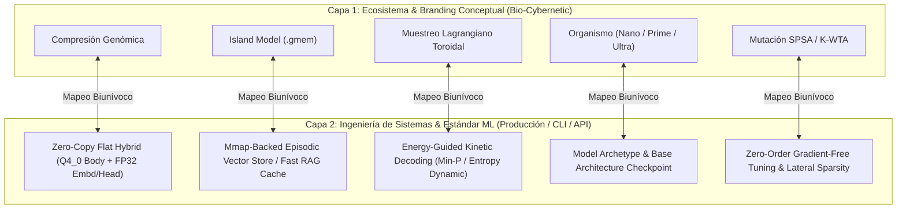

# 🧬 Estandarización de Nomenclatura y Mapeo de Doble Capa (Dual-Layer) en GAJE-Flow

**Estado:** Propuesta Técnica y Guía de Estandarización  
**Versión:** 1.0  
**Fecha:** Septiembre 2026  
**Ámbito:** Arquitectura del Motor, Documentación Técnica (`docs/`), CLI (`gaje-cli`) y APIs

---

## 1. Diagnóstico y Motivación

El proyecto **GAJE (Genomic Adaptive Joint Embedding)** posee una identidad singular y potente: fusiona metáforas biológicas/genómicas (bases nitrogenadas de ADN, dinámica de poblaciones en islas, inhibición lateral K-WTA) y formulaciones de mecánica clásica (muestreo lagrangiano $\mathcal{L} = T - V$) con una ingeniería de sistemas de bajo nivel en Rust de alto rendimiento (mapeo `mmap` zero-copy, kernels SIMD AVX2/NEON, formato híbrido `.flat` v2).

### 1.1. El Hallazgo Principal
* **Fortaleza:** La narrativa bio-cibernética dota al proyecto de una visión clara de "organismo cognitivo local y continuo", diferenciándolo de meros envoltorios (*wrappers*) de inferencia.
* **Fricción / Riesgo:** Para investigadores externos, ingenieros de ML y usuarios habituados al ecosistema estándar (`llama.cpp`, `vLLM`, `Ollama`, PyTorch, Hugging Face), términos como *"Compresión Genómica"*, *"Muestreo Lagrangiano"* o *"Island Model"* pueden inducir a confusión:
  * Se puede interpretar que GAJE procesa secuencias de biología médica (FASTA/ADN real) en vez de pesos tensoriales de LLMs.
  * La dificultad para correlacionar parámetros de física clásica con hiperparámetros estándar (`temperature`, `top_p`, `min_p`) obstaculiza la configuración intuitiva.
  * Quienes buscan soluciones RAG o agentes autónomos pueden pasar por alto la velocidad extrema del formato `.gmem` si no se identifica explícitamente como memoria episódica vectorial.

---

## 2. Estrategia: Arquitectura de Nomenclatura de Doble Capa (Dual-Layer)

Para preservar el alma, la identidad estética y la elegancia conceptual de GAJE sin comprometer la adopción técnica ni la credibilidad empírica, se establece una **arquitectura de doble capa**:



1. **Capa Conceptual (Narrativa & UI):** Permanece en la Web UI, en los manifiestos, en las notas de investigación teórica y en el branding general.
2. **Capa Técnica (Producción, API, CLI & Papers):** Gobierna el código fuente crítico, las banderas de línea de comandos (`gaje-cli --help`), las especificaciones de formato binario y los reportes de certificación empírica.

---

## 3. Mapeo Detallado por Componentes

### 3.1. Formatos y Cuantización de Pesos

* **Término Actual:** Compresión Genómica / Bases ADN de 2-bits ($00=\text{A}, 01=\text{C}, 11=\text{G}, 10=\text{T}$).
* **Realidad de Producción:** Formato `.gaje.flat` v2 con bloques de atención/FFN en $Q4\_0$ (16 centroides empaquetados en nibbles) y capas sensibles (`token_embd`, `lm_head`) en FP32 de precisión completa.
* **Mapeo Propuesto:**
  * **Producción:** `Zero-Copy Flat Hybrid Tensor (Q4_0-FP32)` o `GAJE Flat Format v2`.
  * **Investigación (Frente 2-bit):** `Quaternary Discrete Encoding (Genomic 2-Bit Representation)`.
  * **Documentación:** Aclarar expresamente que "Genómico" refiere a la representación discreta cuaternaria de estados y a la compresión estructural, no a bioinformática médica.

### 3.2. Memoria Persistente y RAG Submilisegundo

* **Término Actual:** Island Model (`.gmem`).
* **Realidad Técnica:** Índice plano de vectores proyectados y alineados a 64 bytes en disco, mapeados en memoria (`mmap`), con búsqueda multinicho y latencia de recuperación de $0.75\text{ ms}$.
* **Mapeo Propuesto:**
  * **Nombre Técnico Oficial:** `Mmap Episodic Vector Memory (.gmem)` o `Partitioned Niche Memory Store`.
  * **Subtítulo Descriptivo:** *"Sub-millisecond persistent context cache via Island Model partitioning"*.
  * **Beneficio:** Ingenieros de agentes y RAG entienden inmediatamente que `.gmem` es una base de datos vectorial embebida ultra-rápida sin dependencias pesadas.

### 3.3. Algoritmo de Generación y Decodificación

* **Término Actual:** Muestreo Lagrangiano de Mínima Acción ($\mathcal{L} = T - V$) / Muestreo Toroidal.
* **Realidad Técnica:** Decodificador de muestreo dinámico donde la energía cinética $T$ modula la entropía/exploración (equivalente a *Dynamic Temperature / Entropy Gating*) y el potencial $V$ penaliza repeticiones o estados de baja probabilidad gramatical (*Min-P / Repetition Penalty*).
* **Mapeo Propuesto:**
  * **Nombre Técnico Oficial:** `Energy-Guided Dynamic Sampling (Action-Decoded Kinetic Sampler)`.
  * **Mapeo de Parámetros:**
    * Energía Cinética ($T$) $\to$ **`--kinetic-temp`** (control dinámico de dispersión).
    * Potencial Restrictivo ($V$) $\to$ **`--potential-penalty`** (supresión de colapso y repetición).
  * **Modo Estándar:** Proveer siempre compatibilidad con las banderas estándar de la industria: `--temperature`, `--top-p`, `--top-k`, `--min-p`.

### 3.4. Catálogo y Clasificación de Modelos

* **Término Actual:** Organismo / Modelo (`gaje_pico`, `gaje_nano`, `gaje_prime`, `gaje_ultra`).
* **Realidad Técnica:** Checkpoints cuantizados adaptados a presupuestos de hardware específicos (móvil, laptop, servidor).
* **Mapeo Propuesto:**
  * Estructura: **`Model Archetype (Organism Profile) / Base Checkpoint`**.
    * `pico`: 135M parámetros (SmolLM2-135M) — Ultra-ligero / Edge / Microcontroladores.
    * `nano`: 0.5B – 1.5B parámetros (Qwen2.5-0.5B/1.5B) — WebAssembly / Teléfonos móviles.
    * `prime`: 3B parámetros (Qwen2.5-3B / Llama-3.2-3B) — Desktops / Portátiles.
    * `ultra`: 7B parámetros (Qwen2.5-7B) — Estaciones de trabajo y Servidores.

### 3.5. Optimización, Aprendizaje y Esparcimiento

* **Término Actual:** Mutación SPSA / K-WTA / Inhibición Lateral.
* **Realidad Técnica:** Optimización estocástica libre de gradientes (*Simultaneous Perturbation Stochastic Approximation*) aplicada a centroides de cuantización, combinada con activación dispersa *k-Winners-Take-All*.
* **Mapeo Propuesto:**
  * **SPSA:** `Zero-Order SPSA Optimization (Gradient-Free Weight Tuning)`.
  * **K-WTA:** `K-WTA Lateral Activation Sparsity`.

---

## 4. Matriz de Equivalencia Rápida (Cheat Sheet)

| Concepto en GAJE | Nomenclatura Conceptual (Ecosistema) | Nomenclatura Estándar de la Industria (ML / Sistemas) | Equivalente / Función Operativa |
| :--- | :--- | :--- | :--- |
| **Cuantización de Pesos** | Compresión Genómica | Formato Plano Híbrido Zero-Copy (`Q4_0-FP32 Flat`) | Cuantización simétrica 4-bit con embeddings preservados en FP32. |
| **Persistencia de Contexto** | Memoria en Islas (`.gmem`) | Memoria Episódica Vectorial Mmap (`.gmem`) | Vector store embebido de acceso instantáneo ($<750\ \mu\text{s}$) para RAG local. |
| **Decodificación de Texto** | Muestreo Lagrangiano de Mínima Acción | Muestreador Dinámico Guiado por Energía (*Kinetic Sampling*) | Regulación de temperatura basada en entropía y penalización dinámica Min-P. |
| **Variantes de Modelos** | Organismos (`pico`, `nano`, `prime`, `ultra`) | Arquetipos de Capacidad / Perfiles de Modelo | Tamaños de parámetro estandarizados (135M, 0.5B-1.5B, 3B, 7B). |
| **Ajuste sin Gradientes** | Mutación Antitética SPSA | Optimización de Orden Cero (*Derivative-Free SPSA Tuning*) | Ajuste de centroides y sesgos sin requerir cálculo de backpropagation completo. |
| **Inhibición de Nodos** | Inhibición Lateral Neuronal | Esparcimiento Dinámico K-WTA (*k-Winners-Take-All*) | Poda selectiva en runtime de activaciones de baja intensidad. |

---

## 5. Especificación de Banderas para `gaje-cli` (Dual-Flag Strategy)

Para que el binario soberano `gaje-cli` sea adoptado sin fricción por desarrolladores acostumbrados a `llama-cli` u `ollama`, se recomienda implementar un esquema de **alias transparentes**:

```bash
# Inferencia con banderas estándar de la industria (Mayor compatibilidad)
gaje-cli chat \
  --model models/production/qwen2.5-1.5b.flat \
  --temp 0.7 \
  --top-p 0.9 \
  --min-p 0.05 \
  --memory-store session.gmem

# Equivalente con nomenclatura nativa avanzada de GAJE (Capa Ecosistema)
gaje-cli chat \
  --organism nano \
  --sampling lagrangian \
  --kinetic-temp 0.7 \
  --potential-penalty 0.1 \
  --island-memory session.gmem
```

---

## 6. Hoja de Ruta de Implementación

1. **Documentación (`README.md` e `INDEX.md`):**
   * Añadir una pequeña tabla de correspondencias al inicio del README principal ("*Rosetta Stone de GAJE*").
2. **Ayuda de la CLI (`src/bin/gaje-cli.rs`):**
   * Incorporar descripciones técnicas claras en los textos de `clap` (`--help`), explicando cada término poético con su traducción técnica.
3. **Catálogos en Hugging Face:**
   * Etiquetar los repositorios no solo con `gaje-organism`, sino también con las etiquetas canónicas: `qwen2.5`, `q4_0`, `mmap`, `fast-inference`, `rust`, `edge-ai`.
4. **Validación Continua:**
   * Garantizar que los reportes de certificación en `docs/reports/` continúen usando métricas formales: TTFT, Throughput (tok/s), RSS (MB), PPL y CosSim.
