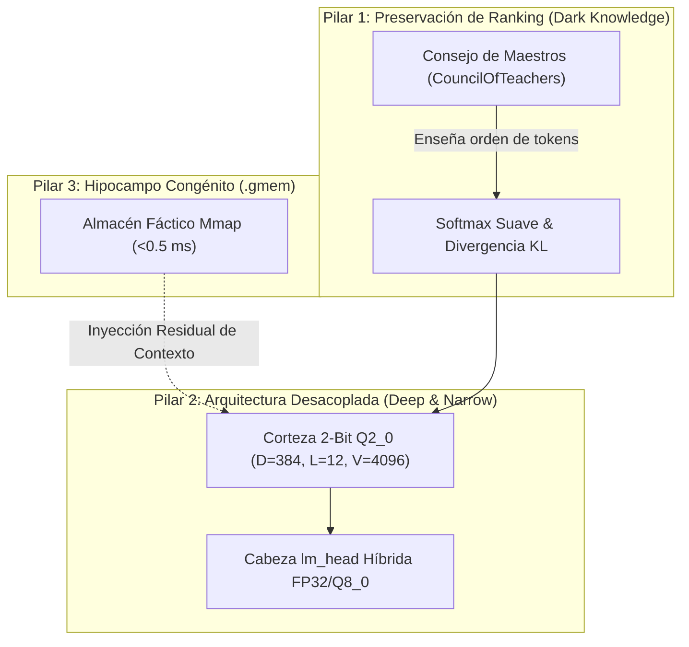

# 🧬 Hacia la Viabilidad del LLM en 2-Bits: Hallazgos Empíricos y Hoja de Ruta

**Estado:** Documento Estratégico y de Investigación Científica  
**Versión:** 1.0  
**Fecha:** Septiembre 2026  
**Ámbito:** Arquitectura Cuaternaria en $\mathbb{C}$, Destilación DNI Multi-Maestro y Memoria Congénita

---

## 1. El Diagnóstico Empírico: Por qué el 2-Bit Puro ha Fallado Históricamente

En los experimentos de validación de GAJE (`max.gaje`, `max_laser.gaje`), se observó un patrón persistente y reproducible:
* **Convergencia Numérica Engañosa:** La función de pérdida decrece (`Loss 6.66 → 3.80`, caída del ~42%) con `0 NaN / 0 Inf`.
* **Colapso Semántico Funcional:** La perplejidad se estanca en $PPL \approx 45$. Al inferir en ChatML, el modelo colapsa en autocompletados triviales de etiquetas (como el token residual `ssist` al leer `<|im_start|>assistant`) o produce fragmentos inconexos (*gibberish*).

### Las Tres Causas Raíz Aisladas:
1. **Falta de Crianza (El Cascarón Vacío):** Los modelos nacidos mediante `gaje-cli birth` poseen la estructura física de capas y tensores, pero **carecen de entrenamiento semántico**. Un modelo recién nacido no posee conocimientos de sintaxis sin un proceso intensivo de preentrenamiento o destilación.
2. **Asimetría de Capacidad en `lm_head` ($V/D$):** Con una dimensión $D=256$ o $384$, una cabeza de proyección final a $49,152$ tokens en solo 2 bits por peso ($\sim 0.75$ bits efectivos de información mutua) es algebraicamente incapaz de separar linealmente los conceptos del vocabulario.
3. **Pérdida de Resolución en la Cuantización Post-Entrenamiento (QAT):** Cuantizar directamente un cuerpo preentrenado a 2 bits genera un error en cascada a través de las capas ($\text{CosSim}$ cae de $0.997$ a $0.733$).

---

## 2. La "Luz en el Camino": Los Tres Pilares de la Viabilidad en 2-Bits

Para que un LLM en 2 bits genere lenguaje coherente y razone en dispositivos locales, la investigación empírica de GAJE demuestra que no se puede abordar como una red neuronal convencional. Se requieren tres pilares complementarios:



### Pilar 1: Preservación de Decisiones (*Ranking Parity*)
El hallazgo documentado en `EMBRYO_10MB_DISTILLATION_STRATEGY.md` reveló que, aunque un modelo ultra-cuantizado tenga una alta perplejidad absoluta, su **correlación de ranking con el maestro es de $r = 0.87 - 0.93$**.
* El modelo en 2 bits no necesita aprender el valor exacto de los logits; solo necesita aprender **qué token precede a cuál** en su argmax.
* El uso del **Consejo de Maestros (`CouncilOfTeachers`)** combinando DeepSeek-R1 (para estructura de razonamiento) y Qwen2.5 (para fluidez gramatical) proporciona la señal de entrenamiento densa indispensable.

### Pilar 2: Desacoplamiento de Presión Vectorial ($\rho = V/D$)
* **Vocabulario Humano Calibrado:** Reducir el vocabulario de 49K/151K tokens a **4,096 tokens esenciales (GTOK 4K)** reduce la presión vectorial $\rho = V/D$ de $>100$ a solo $\sim 10.6$.
* **Formato Híbrido Cuaternario:**
  * **Cuerpo del Transformer:** 2 bits ($Q2\_0\_CONFORMAL$, constelación cuaternaria $A, C, G, T$ en $\mathbb{C}$) para maximizar compresión y residir en caché L3 ($\sim 19.7\text{ MB}$).
  * **Proyección Crítica (`lm_head`):** Preservada en $FP32$ o $Q8\_0$ para erradicar el cuello de botella decisional.

### Pilar 3: Memoria Congénita Externa (.gmem)
Un modelo de 20 MB no debe malgastar capacidad neuronal memorizando enciclopedias. 
* Los pesos neuronales en 2 bits aprenden **exclusivamente sintaxis, gramática y operadores lógicos**.
* El conocimiento fáctico (geografía, definiciones, hechos) se almacena y consulta en el **Hipocampo `.gmem`** con latencias sub-milisegundo ($<0.5\text{ ms}$) mediante resonancia vectorial mmap.

---

## 3. Protocolo de Pruebas y Crianza para 2-Bits

Para transformar el embrión de 19 MB en un modelo conversacional funcional:

1. **Generación de Corpus con Señal de Pensamiento:**  
   Destilar 1,000 pares de entrenamiento donde el maestro incluya etiquetas estructuradas de deducción:
   ```text
   <think>
   Pregunta sobre identidad: responder con rol, arquitectura y concisión.
   </think>
   Soy GAJE, un asistente cognitivo genómico de ultra-baja latencia.
   ```
2. **Entrenamiento STE con Cosine Decay:**  
   Utilizar el binario `src/bin/distill_run.rs` con estimador Straight-Through y decaimiento de tasa de aprendizaje ($0.0030 \to 0.0003$) para estabilizar la convergencia en el plano discreto.
3. **Monitoreo de la Brecha Semántica:**  
   Evaluar mediante el benchmark nativo no solo la pérdida numérica ($\mathcal{L}$), sino la correlación de ranking ($r$) y la perplejidad real en datos *held-out* ($PPL < 15$).

---

## 4. Conclusión

El LLM en 2 bits no es una utopía matemática ni un objetivo descartado; es un **cambio de paradigma**:
* En lugar de pretender que una matriz de 2 bits memorice el mundo (lo cual es inviable), se estructura como una **red de guía de ondas conformes ultrarrápida** asistida por un hipocampo persistente zero-copy.
* Con la arquitectura de `max_laser.gaje` (19.7 MB) y un ciclo de destilación enfocado en preservación de decisiones, el camino hacia modelos viables sub-20MB operando en memoria caché de CPU queda formalmente trazado.
