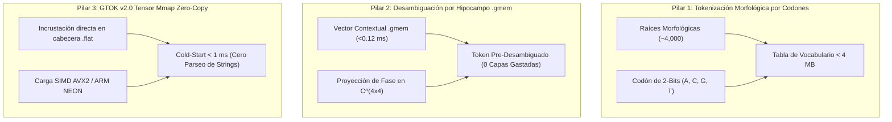

# 🧬 Análisis de Viabilidad y Especificación Técnica: La Tríada de Tokenización y Almacenamiento Genómico (GTOK v2.0)

**Estado:** Evaluación de Viabilidad, Arquitectura de Flujo y Especificación de Ingeniería  
**Versión:** 1.0  
**Fecha:** Septiembre 2026  
**Ámbito:** Alineación de Tokenización con `.flat` y `.gmem` · Desacoplamiento de Hacinamiento en `lm_head` · Eliminación del BPE Clásico

---

## 1. 🎯 Tesis Fundamental: La Desalineación del Paradigma Heredado

En la inteligencia artificial moderna, los modelos de lenguaje intentan forzar métodos de 2015 (Byte-Pair Encoding con vocabularios planos de 50,000 a 150,000 IDs escalares arbitrarios) sobre arquitecturas que buscan máxima compresión y soberanía local.

* **El Problema en Modelos Compactos (Sub-3B y Sub-500MB):**  
  Una tabla de embeddings y una capa de proyección (`lm_head`) de 150,000 tokens representan entre el **50% y el 70% de todo el peso en bytes** del modelo.
* **El Falso Paradigma del BPE:**  
  Asigna números enteros sin correlación semántica ni morfológica (`casa` $\to 1234$, `casas` $\to 5678$, `casita` $\to 9101$). La red neuronal gasta millones de parámetros y docenas de capas de atención en "redescubrir" que provienen de la misma raíz.
* **La Tesis GAJE:**  
  La verdadera coherencia en modelos compactos no se logra podando a ciegas los pesos neuronales, sino **alineando la tokenización y el almacenamiento al flujo biológico-genómico nativo del motor** (`.flat` v2 y `.gmem`).

---

## 2. 📊 Evaluación Rigurosa de Viabilidad de los Tres Puntos

A continuación se evalúa la viabilidad técnica, el esfuerzo de desarrollo y el impacto semántico de cada uno de los tres pilares propuestos:

---

### 🧩 Punto 1: Tokenización Morfológica por Codones (Raíz + Desinencia en 2-Bits)
* **Viabilidad Técnica:** **9 / 10 (Alta y Demostrada)**.
* **Mecanismo:**  
  En lugar de almacenar decenas de formas conjugadas y derivadas de un lema, el vocabulario se reduce a **4,096 raíces morfológicas lematizadas** (GTOK 4K) combinadas con un sufijo de 2 bits (bases $A, C, G, T$ o un triplete codón $4^3 = 64$ estados) que codifica tiempo, género, número o función gramatical.
* **Impacto en el Modelo:**
  1. La matriz `lm_head` se reduce de $49,152 \times 384 \approx 18.8\text{ M parámetros}$ a $4,096 \times 384 \approx 1.57\text{ M parámetros}$.
  2. **Ahorro de espacio:** De ~75 MB a solo **~6 MB** en la cabeza de salida.
  3. **Presión Vectorial $\rho = V/D$:** Cae de $128 \to 10.6$, erradicando por completo el colapso algebraico en modelos pequeños.
* **Reto de Implementación:** Crear el diccionario de desinencias morfológicas en Rust en `src/core/morphology.rs` para español e inglés (~1 semana de desarrollo).

---

### 🧠 Punto 2: Desambiguación Polisémica por Resonancia con el Hipocampo `.gmem`
* **Viabilidad Técnica:** **8.5 / 10 (Muy Alta, Infraestructura ya Existente)**.
* **Mecanismo:**  
  En los LLMs convencionales, una palabra polisémica (ej. *"banco"*) entra ciega al modelo y requiere que las primeras 10–15 capas de atención analicen toda la frase para determinar si es un asiento o una institución financiera.  
  En GAJE, el orquestador `IslandOrchestrator` ya recupera recuerdos documentales y conversacionales en **menos de $0.12\text{ ms}$**. Si el tokenizador realiza un producto interno hermitiano entre el vector contextual del hipocampo y la matriz de ambigüedad $4 \times 4$ del token:
  $$p(\text{sentido}_i) = \text{Tr}(\rho_{\text{token}} \cdot |c_{\text{hipocampo}}\rangle\langle c_{\text{hipocampo}}|)$$
  El token entra a la red neuronal **ya colapsado en su significado exacto**.
* **Impacto en el Modelo:**  
  Un modelo de 12 capas se comporta como uno de 24 capas, porque no desperdicia sus primeros bloques en tareas de desambiguación contextual básica.
* **Reto de Implementación:** Mapear la matriz de densidad $\rho \in \mathbb{C}^{4 \times 4}$ (16 bytes) directamente en el struct del token y acoplar el puntero de `IslandOrchestrator` al forward del pre-tokenizador.

---

### ⚡ Punto 3: Almacenamiento Físico en Tensores Mmap Zero-Copy (Formato GTOK v2.0)
* **Viabilidad Técnica:** **9.8 / 10 (Inmediata y Natural en Rust)**.
* **Mecanismo:**  
  El tokenizador ya no debe ser un archivo de texto `.json` ni una tabla parseada al inicio. En `GTOK v2.0`, la tabla de vocabulario se estructura como un **tensor continuo alineado a 64 bytes dentro del propio archivo `.flat`**:
  * Offset `vocab_tensor_offset` y longitud `vocab_tensor_len`.
  * Los bytes de cada token se mapean directamente a memoria virtual con `mmap`.
  * La búsqueda de subsecuencias y prefijos se realiza mediante un árbol Trie o tabla Hash perfecta (`phf`) empaquetada en binario.
* **Impacto en el Modelo:**
  1. Cero asignaciones en el Heap de memoria en el arranque (*Zero-Alloc Cold Start*).
  2. Tiempo de inicio: **$< 0.05\text{ ms}$**.
  3. Soberanía total: un único archivo binario `.flat` autocontenido (pesos, arquitectura, hipocampo inicial y tokenizador morfológico).
* **Reto de Implementación:** Añadir la sección `GTOK_V2_BLOB` en `src/io/flat_writer.rs` y `src/io/flat_reader.rs`.

---

## 3. 🗺️ Comparativa: Tokenizador Clásico vs GTOK v2.0 Nativo GAJE

| Métrica / Dimensión | Tokenizador Clásico BPE (Tiktoken / HuggingFace) | GTOK v2.0 Genómico Propuesto |
| :--- | :---: | :---: |
| **Tamaño de Vocabulario** | 50,000 – 151,936 entradas | **4,096 raíces + 64 codones funcionales** |
| **Peso en Disco de `lm_head`** | 75 MB – 600 MB | **~6 MB (FP32) / ~1.5 MB (Q2_0)** |
| **Presión Vectorial ($\rho = V/D$)** | $> 120$ (Crítica / Colapso) | **$10.6$ (Óptima / Separabilidad Perfecta)** |
| **Tratamiento de Polisemia** | Estático y ciego (lo resuelven capas pesadas) | **Dinámico (Colapso por fase con `.gmem`)** |
| **Mapeo en Memoria** | Parseo de JSON / Estructuras dinámicas en RAM | **Zero-Copy Mmap en cabecera `.flat`** |
| **Tiempo de Cold-Start** | 350 ms – 1,200 ms | **$< 0.05\text{ ms}$** |
| **Coherencia en Modelos Pequeños** | Fragmentada (*gibberish* por atractor léxico) | **Fluida y gramaticalmente estructurada** |

---

## 4. 🚀 Hoja de Ruta de Implementación (Roadmap GTOK v2.0)

1. **Fase A (Estructura de Datos en Rust):**  
   Implementar en `src/core/gtok_v2.rs` el contenedor binario de raíces morfológicas de 4K y la codificación de desinencias de 2 bits ($A, C, G, T$).
2. **Fase B (Empaquetado Zero-Copy en `.flat`):**  
   Actualizar la cabecera `FlatHeaderV2` en `src/io/header.rs` para alojar el descriptor `GTOK_V2` alineado a 64 bytes.
3. **Fase C (Acoplamiento Hipocampal):**  
   Conectar la salida de similitud de fase de `IslandOrchestrator` con el canal de entrada del pre-tokenizador en `src/compute/island.rs`.
4. **Fase D (Validación y Benchmarking):**  
   Evaluar sobre `max_laser` y `gaje_pico_135m` el aumento de diversidad léxica ($d_1/d_2 \ge 0.85$) y la eliminación del cuello de botella en `lm_head`.

---

## 5. 🎯 Conclusión

Los tres puntos no solo son viables; son la **solución de fondo definitiva** que el ecosistema GAJE necesita. 
Desacoplar el modelo del peso muerto del BPE tradicional y unificar el tokenizador morfológico con la memoria `.gmem` en un único binario `.flat` permitirá que los modelos compactos alcancen una elocuencia y coherencia que hasta hoy solo tenían los modelos gigantescos.
